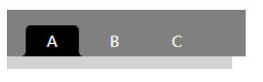
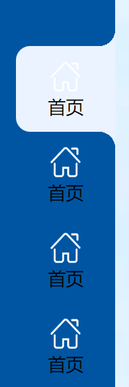

# CSS 实现反向圆角

- 反向圆角，效果类似于谷歌浏览器的 tab

## 横向圆角

**代码**

```html
<nav>
  <div
    :class="{ 'menu-item': true, 'activity': index == selectMenuIndex }"
    v-for="(menuInfo,index) in menuList"
    :key="index"
    @click="handelMenuClick(index)"
  >
    {{ menuInfo.title }}
  </div>
</nav>
```

```css
:root {
  font-size: 8px;
  --radius-size: 4px;
  --acticity-color: black;
}

.menu-item {
  color: white;
  padding: 0.5rem 2rem;
  cursor: pointer;
  margin-right: 1rem;
  border-radius: 4px 4px 0 0;
  position: relative;
}

.menu-item.activity {
  background: var(--acticity-color);
}

.menu-item.activity::before,
.menu-item.activity::after {
  content: "";
  display: block;
  height: var(--radius-size);
  width: var(--radius-size);
  position: absolute;
  bottom: 0;
  background: radial-gradient(
    var(--radius-size) at var(--radius-size) 0px,
    transparent var(--radius-size),
    var(--acticity-color) var(--radius-size)
  );
}
.menu-item.activity::before {
  left: calc(-1 * var(--radius-size));
  transform: scaleX(-1);
}
.menu-item.activity::after {
  right: calc(-1 * var(--radius-size));
}
```

**实现效果**


## 竖向圆角

**代码**

```scss
$radius-size: 0.9rem;
$acticity-color: #eaf3ff;

.menu-item {
  width: 5.6rem;
  height: 4.8rem;
  //background: #EAF3FF;
  border-radius: 0.8rem 0 0 0.8rem;
  cursor: pointer;
  display: flex;
  justify-content: center;
  flex-direction: column;
  align-items: center;
  position: relative;
}

.menu-item.activity {
  background: $acticity-color;
}

.menu-item.activity::before,
.menu-item.activity::after {
  content: "";
  display: block;
  height: $radius-size;
  width: $radius-size;
  position: absolute;
  right: 0;
  background: radial-gradient(
    $radius-size at $radius-size 0px,
    transparent $radius-size,
    $acticity-color $radius-size
  );
}
.menu-item.activity::before {
  //right: calc(-1 * 10px);
  top: calc(-1 * 0.9rem);
  z-index: 10;
  transform: scaleX(-1);
}
.menu-item.activity::after {
  //right: calc(-1 * 10px);
  transform: scale(-1);
  z-index: 10;
  bottom: calc(-1 * 0.9rem);
}
```

**实现效果**
