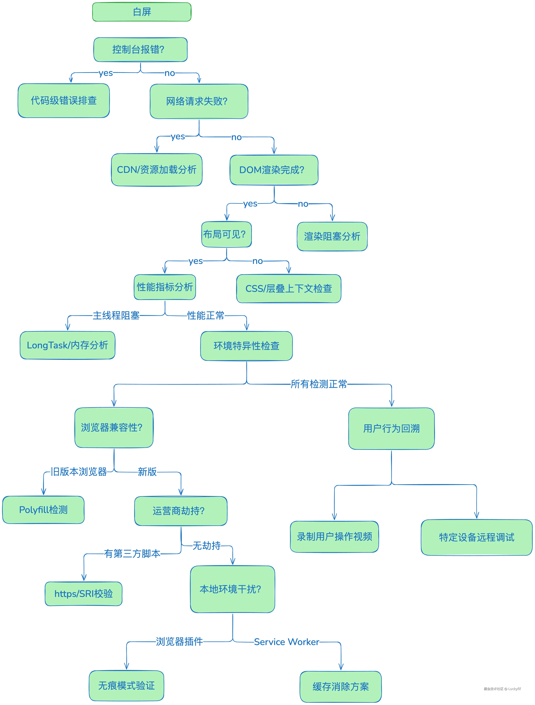
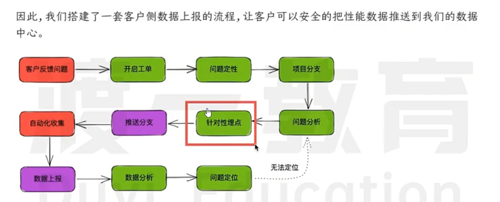
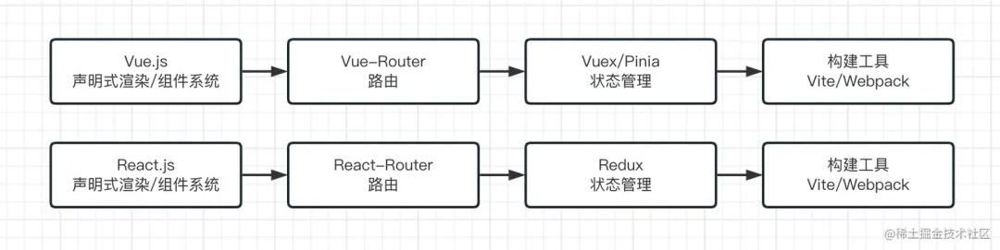

# JavaScript 技巧

## 一、为什么`typeof []` 的返回值是 `"object"`

### 历史原因

JavaScript 最初设计时开发周期较短，语言的类型系统设计相对简单。在早期版本中，JavaScript 只有少数几种基本数据类型（如 `number`、`string`、`boolean`、`null`、`undefined`），而其他所有非基本数据类型的值都被归类为 `object`。数组在 JavaScript 中属于复合数据类型，并非基本数据类型，因此按照当时的设计逻辑，`typeof` 运算符对数组返回 `"object"`。

### 底层实现机制

JavaScript 中的值在底层以二进制形式存储，每个值都有一个类型标签来表示其类型。在 JavaScript 引擎内部，类型标签是一个很小的整数，用于标识值的类型。对于大多数对象（包括数组），类型标签表示的就是对象类型。`typeof` 运算符是根据这个类型标签来判断值的类型的，由于数组的类型标签和普通对象一样被标记为对象类型，所以 `typeof []` 返回 `"object"`。

### 示例代码验证

```javascript
console.log(typeof []); // 输出: "object"
console.log(typeof {}); // 输出: "object"
```

### 如何准确判断数组类型

由于 `typeof` 无法准确区分数组和普通对象，你可以使用以下几种方法来判断一个值是否为数组：

- **`Array.isArray()` 方法**：这是 ES5 引入的方法，专门用于判断一个值是否为数组，使用起来简单直接。

```javascript
const arr = [];
console.log(Array.isArray(arr)); // 输出: true
```

- **`instanceof` 运算符**：用于检测构造函数的 `prototype` 属性是否出现在某个实例对象的原型链上。
  **虽然通常可用,但在多框架环境下可能失效,因为 Array 构造函数可能来自不同的执行上下文。另外,如果修改了对象的原型链,这个方法也会失效。**

```javascript
const arr = [];
console.log(arr instanceof Array); // 输出: true
```

- **`Object.prototype.toString.call()` 方法**：可以返回一个表示对象类型的字符串，通过判断该字符串是否为 `[object Array]` 来确定是否为数组。

```javascript
const arr = [];
console.log(Object.prototype.toString.call(arr) === "[object Array]"); // 输出: true
```

## 二、toString()

1. `toString()` 方法用于将一个对象转换为字符串。
2. `2.toString()` 会导致语法错误,因为 JavaScript 解析器会将点号优先识别为小数点，而不是对象属性访问符，所以会报语法错误。
3. `2..toString()` 第一个点号被解析为小数点，第二个点号被正确解析为对象属性访问符。这种写法虽然看起来怪异，但在 JavaScript 中是完全有效的语法。
4. `2 .toString()` 通过在数字和点号之间添加空格，可以帮助 JavaScript 解析器正确理解这是一个方法调用而不是小数点。这种写法语法正确且清晰。
5. `(2).toString()`使用括号将数字括起来，可以明确地将其转换为对象，然后调用 toString()方法。这是最常用和最清晰的写法。

- 开发中推荐使用 D 的写法，因为它最清晰易懂。

## 三、window.open

1. `window.open()` 方法用于在浏览器中打开一个新的窗口或标签页。
2. `window.open()` 方法的第一个参数是要打开的 URL，第二个参数是窗口名称，第三个参数是窗口特性。
3. `window.open()` 方法返回一个对新打开窗口的引用，如果浏览器不允许弹出窗口，则返回 `null`。
4. `window.open()` 方法的行为可能会受到浏览器的弹出窗口拦截器的影响，因此在某些情况下可能无法打开新窗口。
5. 调用 window.open 方法以后，远程 URL 不会被立即载入，载入过程是异步的。

## 四、JS 数字在计算机内存中占用多少 Byte

**8 个 Byte 4 个字节**
这是因为 JavaScript 遵循 IEEE 754 标准,使用双精度浮点数来表示所有数值类型。在这个格式中:

- 1 位用于符号(正负)
- 11 位用于指数
- 52 位用于小数部分(尾数)
  总共 64 位,也就是 8 字节。

## 五、js 中的运算符优先级

1. 成员访问和计算属性

   `.`（点操作符）

   `[]`（计算属性）

   `new`（创建实例）

   `()`（函数调用）

   `new.target`（在构造函数中使用）

2. 新的运算符（ES6+）

   `...`（展开运算符）

   `super`（调用父类的构造函数）

3. 递增和递减

   `++`（递增）

   `--`（递减）

4. 一元运算符

   `delete`

   `void`

   `typeof`

   `+`（一元加）

   `-`（一元减）

   `~`（位非）

   `!`（逻辑非）

5. 乘法、除法和取模

   `\*`（乘法）

   `/`（除法）

   `%`（取模）

6. 加法和减法

   `+`（加法）

   `-`（减法）

7. 小于、大于和相等比较

   `<`（小于）

   `>` （大于）

   `<=`（小于等于）

   `>=`（大于等于）

   `in`（属性存在）

   `instanceof`（实例检查）

8. 等号

   `==`（等于）

   `!=`（不等于）

   `===`（严格等于）

   `!==`（严格不等于）

9. 按位与

   `&`（按位与）

10. 按位异或

    `^`（按位异或）

11. 按位或

    `|`（按位或）

12. 逻辑与

    `&&`（逻辑与）

13. 逻辑或

    `||`（逻辑或）

14. 可选链（ES2020+）

    `?.`（可选链操作符）

15. 空值合并运算符（ES2020+）

    `??`（空值合并操作符）

16. 条件（三元）运算符

    `?:`（条件运算符）

17. 赋值运算符

    `=`（赋值）

    `+=`、`-=`、`\*=`、`/=`、`%=`、`<<=`、`>>=`、`>>>=`、`&=`、`^=`、`|=`等复合赋值运算符。

18. 逗号运算符

    `,`（逗号运算符，通常用于分隔多个表达式在单个语句中执行，但优先级最低，因为它主要用于分隔表达式而不是控制运算顺序。）

## 六、sessionStorage、localStorage、cookie

1. 存储容量：
   - `cookie`：每个 cookie 大小限制在 4KB 左右，浏览器对每个域名的 cookie 数量有限制（通常是 20 个）。
   - `sessionStorage`：每个域名的存储容量通常在 5MB 到 10MB 之间。
   - `localStorage`：每个域名的存储容量通常在 5MB 到 10MB 之间。
2. 存储方式：`cookie`、`sessionStorage`、`localStorage` 都是键值对存储，但存储方式不同。

3. 存储时间：`localStorage`的数据会永久保存,`sessionStorage`的数据在页面关闭后失效,`cookie`的数据在浏览器关闭后失效。

4. 三者都受同源策略限制,不能跨域访问

## 七、export 命令

1. export 语句输出的接口，与其对应的值是动态绑定关系，即通过该接口，可以取到模块内部实时的值
2. export 命令必须提供对外的接口，其他脚本才可以通过这个接口，取到对应的值，本质上是在接口名与模块内部变量之间，建立了一一对应的关系

## 八、选择题

```js
for(var i=0;i<3;++i){
    setTimeout(function(){
        console.log(i)；
    },100);
}
// 答案: 3,3,3
```

- 详细分析过程如下:

1. for 循环创建了 3 个 setTimeout 任务,每个任务都包含一个回调函数
2. 这些回调函数都共享同一个变量 i,因为 var 声明的是函数作用域变量
3. 当 setTimeout 的回调函数真正执行时,循环已经完成,此时 i 的值已经变成 3
4. 所以三个回调函数执行时读取到的都是同一个 i 的值,即 3

- 如果想要实现 0,1,2 的输出,可以:

1. 使用 let 代替 var 声明 i
2. 使用闭包保存每次循环时 i 的值
3. 将 i 作为参数传入立即执行函数

## 九、选择题

```js
const print = (fn) => {
  let a = 200;
  fn();
};
let a = 100;
const fn = () => {
  console.log(a);
};
print(fn);
// 答案：200
```

- 关于闭包和作用域的理解，自由变量的查找是在函数定义的地方，向上级查找，而不是在执行的地方

## 十、静态方法和实例方法

1. 静态方法：属于类本身的方法，可以直接通过类名调用，不需要实例化对象。
2. 实例方法：属于实例对象的方法，需要通过实例对象调用。
3. 区别：

- 静态方法通过类名调用
- 实例方法通过实例调用
- 静态方法中的 this 指向类本身
- 实例方法中的 this 指向实例对象

## 十一、阻止浏览器默认行为

- 在现代浏览器中,推荐使用`event.preventDefault()`。
- `window.event.cancelBubble = true `是用来阻止事件冒泡的,不是用来阻止默认行为的
- `event.preventDefault()` 是标准 DOM 事件模型中用来阻止默认行为的方法,但在 IE 浏览器中不支持,所以不是通用解决方案。
- `event.stopPropagation()` 同样是用来阻止事件冒泡的方法,这是标准 DOM 事件模型中的方法,不能阻止默认行为。

## 十二、Node.js 模块加载机制

1. 首先查找核心模块(CORE MODULES)
   Node.js 会优先检查是否是内置的核心模块,如 fs、http 等。

2. 其次查找当前目录下的模块文件(B 选项路径)
   在当前目录下查找 othermodule.js 文件。

3. 然后查找当前目录的 node_modules 目录(A 选项路径)
   在当前目录的 node_modules 文件夹中查找 othermodule 模块。

4. 最后逐级向上查找 node_modules 目录(D 选项路径)
   如果在当前目录没找到,就会往上一级目录查找其 node_modules。

这种查找顺序设计保证了:

1. 核心模块的加载优先级最高
2. 本地模块优先于全局模块
3. 遵循就近原则,从当前目录逐步向上查找
4. 提高了模块的查找效率和可维护性

## 十三、js 变量提升

```js
var a = 1;
function test() {
  console.log(a);
  if (false) {
    var a = 2;
  }
}
test();
// 答案：undefined
```

上述代码等价于：

```js
var a = 1;
function test() {
  var a; // 变量提升，此时a是undefined
  console.log(a);
  if (false) {
    a = 2; // 这行代码永远不会执行
  }
}
```

## 十四、选择题

```js
console.log(0 && 1, 0 || 1, 1 && 3, 1 || 3);
// 0 1 3 1
```

- 0 && 1 结果为 0：
  因为&&运算符遇到假值就会立即返回,0 是假值,所以直接返回 0。

- 0 || 1 结果为 1：
  因为||运算符遇到假值会继续往后找真值,0 是假值所以继续判断 1,1 是真值所以返回 1。

- 1 && 3 结果为 3：
  因为&&运算符在左侧为真值时会返回右侧操作数,1 是真值所以返回 3。

- 1 || 3 结果为 1：
  因为||运算符遇到真值就会立即返回,1 是真值所以直接返回 1。

## 十五、for in 与 for of 区别

在 JavaScript 中，`for...in` 和 `for...of` 是两种不同的循环结构，用途和行为也有所不同。以下是它们的区别和适用场景：

---

### **1. `for...in`**

#### 语法：

```javascript
for (let i in item) {
  // 执行代码
}
```

#### 特点：

- **用于遍历对象的可枚举属性**。
- `i` 是属性名（键），而不是值。
- 主要适用于对象（包括数组、普通对象等）。
- 遍历的是对象的**键**，而不是值。

#### 示例：

```javascript
let obj = { a: 1, b: 2, c: 3 };

for (let key in obj) {
  console.log(key); // 输出: "a", "b", "c"
  console.log(obj[key]); // 输出: 1, 2, 3
}

// 数组的情况
let arr = ["x", "y", "z"];
for (let index in arr) {
  console.log(index); // 输出: "0", "1", "2" （索引）
  console.log(arr[index]); // 输出: "x", "y", "z" （值）
}
```

#### 注意事项：

- 对于数组，`for...in` 遍历的是数组的索引（字符串形式），而不是元素值。
- 不建议用 `for...in` 遍历数组，因为它会遍历所有可枚举属性（包括原型链上的属性），可能会导致意外行为。
- 如果需要遍历对象的键，使用 `for...in` 是合适的。

---

### **2. `for...of`**

#### 语法：

```javascript
for (let i of item) {
  // 执行代码
}
```

#### 特点：

- **用于遍历可迭代对象（如数组、字符串、Map、Set 等）的值**。
- `i` 是值本身，而不是键或索引。
- 只能用于实现了 **`[Symbol.iterator]`** 方法的对象（即支持迭代协议的对象）。
- 不适用于普通的对象（非可迭代对象）。

#### 示例：

```javascript
// 数组
let arr = ["x", "y", "z"];
for (let value of arr) {
  console.log(value); // 输出: "x", "y", "z"
}

// 字符串
let str = "hello";
for (let char of str) {
  console.log(char); // 输出: "h", "e", "l", "l", "o"
}

// Map
let map = new Map([
  ["a", 1],
  ["b", 2],
]);
for (let [key, value] of map) {
  console.log(key, value); // 输出: "a 1", "b 2"
}

// Set
let set = new Set([1, 2, 3]);
for (let value of set) {
  console.log(value); // 输出: 1, 2, 3
}
```

#### 注意事项：

- 普通对象不是可迭代对象，因此不能直接使用 `for...of`。
  ```javascript
  let obj = { a: 1, b: 2 };
  for (let value of obj) {
    console.log(value); // 报错：obj is not iterable
  }
  ```
- 如果需要对普通对象使用 `for...of`，可以先将其转换为可迭代的形式，例如通过 `Object.entries()`。

---

### **总结对比**

| 特性                 | `for...in`                   | `for...of`                              |
| -------------------- | ---------------------------- | --------------------------------------- |
| **适用范围**         | 对象（包括数组、普通对象等） | 可迭代对象（数组、字符串、Map、Set 等） |
| **返回值**           | 键（属性名）                 | 值                                      |
| **是否适合数组**     | 不推荐，可能包含额外属性     | 推荐，直接遍历数组的值                  |
| **是否适合普通对象** | 适合，用于遍历对象的键       | 不适合，普通对象不可迭代                |

---

### **选择建议**

1. 如果需要遍历对象的键（属性名），使用 `for...in`。
2. 如果需要遍历数组、字符串或其他可迭代对象的值，使用 `for...of`。
3. 如果需要同时获取键和值，可以结合 `Object.entries()` 使用 `for...of`：
   ```javascript
   let obj = { a: 1, b: 2 };
   for (let [key, value] of Object.entries(obj)) {
     console.log(key, value); // 输出: "a 1", "b 2"
   }
   ```

## 十六、new Boolean()与 Boolean()区别

```js
var x = new Boolean(false);
if (x) {
  alert("hi");
}
var y = Boolean(0);
if (y) {
  alert("hello");
}
```

- `var x = new Boolean(false)` 创建了一个 `Boolean` 对象。尽管传入的参数是 `false`，但是在 `if` 语句中进行条件判断时，对象总是会被计算为 `true`，因此会执行 `alert('hi')`。

- `var y = Boolean(0)` 则是调用 `Boolean` 函数将 `0` 转换为布尔值 `false`，在 `if` 语句中进行条件判断时，`false` 不会执行对应的代码块，因此不会执行 `alert('hello')`。

## 十七、选择题

```js
output(
  typeof (function () {
    output("Hello World!");
  })()
);
// Hello World! undefined
```

- 逐步分析执行过程：

1. 首先,定义了一个匿名函数 `function() {output("Hello World!")}`
2. 通过末尾的()立即执行这个函数
3. 函数执行时会先输出"Hello World!"
4. 函数没有显式的 return 语句,所以返回 undefined
5. 最后对这个 undefined 值执行 typeof 操作,结果为"undefined"
6. 最终输出"undefined"

- 任何函数执行完一次，如果没有 return 返回值和声明变量接受返回值，都会立即消失，永远找不到值！

## 十八、解构

```js
const [a, b] = "123";
const { c, d } = "123";
console.log(a); // 输出：1
console.log(b); // 输出：2
console.log(c); // 输出：undefined
console.log(d); // 输出：undefined
```

- 使用数组解构时，被解构的值需要包含一个迭代器，而字符串原生就携带有一个 Iterator 迭代器，因此可以顺利的对字符串'123'进行解构
- 使用对象解构时，被解构值需要被强制转换为对象，因此字符串'123'被转换为 String 对象，但是当解构一个未定义的属性时得到的值为 undefined

## 十九、闭包

- 闭包的核心特性就是能够访问其他函数内部的变量。它可以"记住"并访问所在的词法作用域,即使函数是在当前词法作用域之外执行。
- 过度使用闭包确实可能导致内存泄露。因为闭包会保持对外部变量的引用,如果闭包的生命周期较长,就会阻止这些变量被垃圾回收器回收。
- 从技术角度来说,所有的 JavaScript 函数都是闭包,因为它们都可以访问外部作用域的变量。即使是一个简单的函数,也会创建一个闭包来访问其所在的词法环境。

## 二十、选择题

```js
let obj = {
  num1: 117,
};
let res = obj;
obj.child = obj = { num2: 935 };
var x = (y = res.child.num2);
console.log(obj.child); // 输出：undefined
console.log(res.num1); // 输出：117
console.log(y); // 输出：935
console.log(x); // 输出：935
console.log(obj); // 输出：{num2: 935}
console.log(res); // 输出：{num1: 117,child: {num2: 935}}
```

## 二十一、axios 取消请求方法

- Axios 自带的 cancelToken 对象
  `AbortController` 是一个浏览器提供的 API，用于取消正在进行的异步操作，如 Fetch 请求或 Axios 请求。你可以创建一个 `AbortController` 实例，并在 Axios 请求配置中通过 signal 属性传递它。

```js
import axios from "axios";

const controller = new AbortController();

axios
  .get("/foo/bar", {
    signal: controller.signal,
  })
  .then((response) => {
    // 处理响应
  })
  .catch((error) => {
    if (error.name === "AbortError") {
      console.log("请求被取消");
    } else {
      console.error("发生了一个错误:", error);
    }
  });

// 取消请求
controller.abort();
```

- 浏览器内置的 AbortController 对象
  CancelToken 是 Axios 自带的一个类，用于实现请求取消功能。你需要创建一个 CancelToken 实例，并在请求配置中通过 cancelToken 属性传递它。

```js
import axios from "axios";
import CancelToken from "axios/cancelToken";

let cancel;

// 发起请求
axios
  .get("/foo/bar", {
    cancelToken: new CancelToken((c) => (cancel = c)),
  })
  .then((response) => {
    // 处理响应
  })
  .catch((error) => {
    if (axios.isCancel(error)) {
      console.log("请求被取消");
    } else {
      console.error("发生了一个错误:", error);
    }
  });

// 取消请求
if (cancel) {
  cancel("取消请求的原因");
}
```

摘自[Axios 取消请求，封装全局取消请求，axios-retry 请求重试](https://juejin.cn/post/7406166286130135081?searchId=202504221620580D5651B8CE2316AFCF63)

[axios 取消请求原理参考](https://juejin.cn/post/7284417436752265277?searchId=20250422163230E92011E94A065597E303)

## 二十二、内存泄漏情况

1. 全局变量

```js
// 意外的全局变量
function foo(arg) {
  bar = "this is a hidden global variable";
}

// this创建的
function foo() {
  this.variable = "potential accidental global";
}
// foo 调用自己，this 指向了全局对象（window）
foo();
```

- 使用严格模式，可以避免意外的全局变量

2. 闭包

```js
function bindEvent() {
  var obj = document.createElement("XXX");
  var unused = function () {
    console.log(obj, "闭包内引用obj obj不会被释放");
  };
  obj = null; // 解决方法
}
```

3. 定时器

```js
var someResource = getData();
setInterval(function () {
  var node = document.getElementById("Node");
  if (node) {
    // 处理 node 和 someResource
    node.innerHTML = JSON.stringify(someResource);
  }
}, 1000);
```

4. 没有及时清除的 dom 元素

```js
const refA = document.getElementById("refA");
document.body.removeChild(refA); // dom删除了
console.log(refA, "refA"); // 但是还存在引用能console出整个div 没有被回收
refA = null;
console.log(refA, "refA"); // 解除引用
```

5. 没有及时清除监听事件

```js
function test() {
  let el = document.createElement("div");
  document.body.appendChild(el);
  let child = document.createElement("div");
  el.appendChild(child);
  
  document.body.removeChild(el) // 由于 el 变量存在，el及其子元素都不能被GC
  el = null;   // 虽置空了 el 变量，但由于 child 变量引用 el 的子节点，所以 el 元素依然不能被GC
  child = null; // 已无变量引用，此时el可以GC
  
}
​
test();
```

6. 循环引用

- 如果两个对象相互引用，且不存在其他对象对它们的引用，就会导致这两个对象无法被正常释放，从而导致内存泄漏。

```js
function test() {
  var obj1 = {};
  var obj2 = {};
  obj1.prop = obj2;
  obj2.prop = obj1;
}
test();
```

7. eventBus 未清理

- 在 Vue 应用中，eventBus 是常用的组件通信方式之一，但如果使用不当，也会导致内存泄漏。

8. 未调用销毁函数

```js
const sortableInstance = Sortable.create(……)
sortableInstance.destroy()
```

- 调用 destroy() 以移除插件中创建的事件及对象，否则可能造成内存泄漏。

9. 未清理的 Console 输出
   当开发人员使用 Console 输出大量数据时，这些数据可能会残留在浏览器的内存中，并在长时间的使用后导致浏览器变慢，并占用大量的内存。虽然这些数据不会直接导致内存泄漏，但是会降低应用程序的响应速度和性能，影响用户体验。

## 二十三、APP 与 H5 通信

[JSBridge](https://juejin.cn/post/7293728293768855587?searchId=2025042311531746337FABD975D5F3B315#heading-4)

1. JsBridge

- 实现步骤
  1. 初始化 WebViewJavascriptBridge 对象：
     - 对于 Android，如果 WebViewJavascriptBridge 对象已经存在，则直接使用；如果不存在，则在 'WebViewJavascriptBridgeReady' 事件触发时获取 WebViewJavascriptBridge 对象。
     - 对于 iOS，如果 WebViewJavascriptBridge 对象已经存在，直接使用；如果不存在，则创建一个隐藏的 iframe 来触发 WebViewJavascriptBridge 的初始化，并在初始化完成后通过 WVJBCallbacks 回调数组来获取 WebViewJavascriptBridge 对象。
  2. 注册事件
     提供了 callHandler 和 registerHandler 两个方法，分别用于在 JS 中调用 APP 端的方法和注册供 APP 端调用的 JS 方法。
  3. 调用方法
     当 APP 或 JS 需要调用对方的方法时，只需调用 callHandler 或 registerHandler 方法即可。

```js
const { userAgent } = navigator;
const isAndroid = userAgent.indexOf("android") > -1; // android终端

/**
 * Android  与安卓交互时：
 *      1、不调用这个函数安卓无法调用 H5 注册的事件函数；
 *      2、但是 H5 可以正常调用安卓注册的事件函数；
 *      3、还必须在 setupWebViewJavascriptBridge 中执行 bridge.init 方法，否则：
 *          ①、安卓依然无法调用 H5 注册的事件函数
 *          ①、H5 正常调用安卓事件函数后的回调函数无法正常执行
 *
 * @param {*} callback
 */
function androidFn(callback) {
  if (window.WebViewJavascriptBridge) {
    callback(window.WebViewJavascriptBridge);
  } else {
    document.addEventListener(
      "WebViewJavascriptBridgeReady",
      () => {
        callback(window.WebViewJavascriptBridge);
      },
      false
    );
  }
}

/**
 * IOS 与 IOS 交互时，使用这个函数即可，别的操作都不需要执行
 */
function iosFn(callback) {
  if (window.WebViewJavascriptBridge) {
    return callback(window.WebViewJavascriptBridge);
  }
  if (window.WVJBCallbacks) {
    return window.WVJBCallbacks.push(callback);
  }
  window.WVJBCallbacks = [callback];
  const WVJBIframe = document.createElement("iframe");
  WVJBIframe.style.display = "none";
  WVJBIframe.src = "https://__BRIDGE_LOADED__";
  document.documentElement.appendChild(WVJBIframe);
  setTimeout(() => {
    document.documentElement.removeChild(WVJBIframe);
  }, 0);
}

/**
 * 注册 setupWebViewJavascriptBridge 方法
 *  之所以不将上面两个方法融合成一个方法，是因为放在一起，那么就只有 iosFuntion 中相关的方法体生效
 */
const setupWebViewJavascriptBridge = isAndroid ? androidFn : iosFn;

/**
 * 这里如果不做判断是不是安卓，而是直接就执行下面的方法，就会导致
 *      1、IOS 无法调用 H5 这边注册的事件函数
 *      2、H5 可以正常调用 IOS 这边的事件函数，并且 H5 的回调函数可以正常执行
 */
if (isAndroid) {
  /**
   * 与安卓交互时，不调用这个函数会导致：
   *      1、H5 可以正常调用 安卓这边的事件函数，但是无法再调用到 H5 的回调函数
   *
   * 前提 setupWebViewJavascriptBridge 这个函数使用的是 andoirFunction 这个，否则还是会导致上面 1 的现象出现
   */
  setupWebViewJavascriptBridge((bridge) => {
    console.log("打印***bridge", bridge);
    // 注册 H5 界面的默认接收函数（与安卓交互时，不注册这个事件无法接收回调函数）
    bridge.init((message, responseCallback) => {
      responseCallback("JS 初始化");
    });
  });
}

export default {
  // js调APP方法 （参数分别为:app提供的方法名  传给app的数据  回调）
  callHandler(name, params, callback) {
    setupWebViewJavascriptBridge((bridge) => {
      bridge.callHandler(name, params, callback);
    });
  },

  // APP调js方法 （参数分别为:js提供的方法名  回调）
  registerHandler(name, callback) {
    setupWebViewJavascriptBridge((bridge) => {
      bridge.registerHandler(name, (data, responseCallback) => {
        callback(data, responseCallback);
      });
    });
  },
};
```

总结：

1. 跟 IOS 交互的时候，只需要且必须注册 iosFuntion 方法即可，不能在 setupWebViewJavascriptBridge 中执行 bridge.init 方法，否则 IOS 无法调用到 H5 的注册函数；
2. 与安卓进行交互的时候

- 使用 iosFuntion，就可以实现 H5 调用 安卓的注册函数，但是安卓无法调用 H5 的注册函数， 并且 H5 调用安卓成功后的回调函数也无法执行
- 使用 andoirFunction 并且要在 setupWebViewJavascriptBridge 中执行 bridge.init 方法， 安卓才可以正常调用 H5 的回调函数，并且 H5 调用安卓成功后的回调函数也可以正常执行了

H5 使用
h5 获取 app 返回数据

```js
jsBridge.callHandler("getAppUserInfo", { title: "首页" }, (data) => {
  console.log("获取app返回的数据", data);
});
```

app 获取 h5 数据

```js
jsBridge.registerHandler("getInfo", (data, responseCallback) => {
  console.log("打印***get app data", data);
  responseCallback("我是返回的数据");
});
```

两者都可通信，只要一方使用 registerHandler 注册了事件，另一方通过 callHandler 接受数据

[postMessage 和 iframe](https://juejin.cn/post/7294425916549152783#heading-9)

1. postMessage
   postMessage 可以安全地实现跨源通信。从广义上讲，一个窗口可以获得对另一个窗口的引用（比如  targetWindow = window.opener），然后在窗口上调用  targetWindow.postMessage()  方法分发一个  MessageEvent  消息。

A:

```html
<input type="text" id="ipt" />
<button id="btn">点击操作页面</button>
<script>
  btn.onclick = function () {
    const w2 = window.open("http://127.0.0.1:5500/src/utils/index2.html");

    w2.onload = function () {
      w2.postMessage("页面一 发送====> 页面二", "http://127.0.0.1:5500");
    };
  };

  window.addEventListener("message", function (e) {
    console.log(e.data);
    ipt.value = e.data;
  });
</script>
```

B:

```html
<h2 id="h2">标题二</h2>
<button id="btn">点击</button>

<script>
  const parentWindow = window.opener;
  /* 如果是从 http://127.0.0.1:5500 中的某个页面将B页面打开，那么就能成功发送跨文档信息
     如果讲此处的URI换成"*"，就意味着任何网页打开B页面，都能收到B页面传输的信息
     */
  btn.onclick = function () {
    parentWindow.postMessage(h2.innerHTML, "http://127.0.0.1:5500");
  };
  window.addEventListener("message", function (e) {
    console.log(e.data);
    ipt.value = e.data;
  });
</script>
```

1. iframe:
   父:

```html
<iframe
  src="http://127.0.0.1:5500/src/utils/index2.html"
  frameborder="1"
  width="100%"
  height="500px"
  id="Bframe"
></iframe>

<script>
  window.onload = () => {
    let frame = window.frames[0];
    frame.postMessage("父====>子", "http://127.0.0.1:5500");
  };
  window.addEventListener("message", function (e) {
    console.log("父接受数据", e.data);
  });
</script>
```

子:

```html
<input type="text" id="ipt" />
<button id="frameBtn">iframe点击</button>

<script>
  frameBtn.onclick = function () {
    window.top.postMessage(h2.innerHTML, "http://127.0.0.1:5500");
  };
  window.addEventListener("message", function (e) {
    console.log(e.data);
    ipt.value = e.data;
  });
</script>
```

## 二十四、js 实现函数重载

1.  JQuery 实现

```js
// 实现
function addMethod(object, name, fn) {
  const old = object[name];
  object[name] = function (...args) {
    if (args.length === fn.length) {
      return fn.apply(this, args);
    } else if (typeof old === "function") {
      return old.apply(this, args);
    }
  };
}
// 使用
const searcher = {};

addMethod(searcher, "getUsers", () => {
  console.log("查询所有用户");
});
addMethod(searcher, "getUsers", (name = "a") => {
  console.log("按照姓名查询用户");
});
addMethod(searcher, "getUsers", (firstName, sex) => {
  console.log("按照姓名和性别查询用户");
});
searcher.getUsers();
```

**局限性**：

- 只能是对象的方法重载。
- 只能实现函数参数个数的重载，不能实现函数参数类型的重载。
- 参数默认值会判断失败。

2. js 实现

```js
// 实现
function createOverload() {
  const fnMap = new Map();
  function overload(...args) {
    const key = args.map((it) => typeof it).join(",");
    const fn = fnMap.get(key);
    if (!fn) {
      throw new TypeError("没有找到对应的实现函数");
    }
    return fn.apply(this, args);
  }
  overload.addImpl = function (...args) {
    const fn = args.pop();
    if (typeof fn !== "function") {
      throw new TypeError("最后一个参数必须是函数");
    }
    const key = args.join(",");
    fnMap.set(key, fn);
  };
  return overload;
}
// 使用
const getUsers = createOverload();
getUsers.addImpl(() => {
  console.log("查询所有用户");
});
const searchPage = (page, size = 10) => {
  console.log("分页查询用户");
};
getUsers.addImpl("number", searchPage);
getUsers.addImpl("number", "number", searchPage);
getUsers.addImpl("string", (name = "a") => {
  console.log("按照姓名查询用户");
});
getUsers.addImpl("string", "string", (firstName, sex) => {
  console.log("按照姓名和性别查询用户");
});
getUsers();
```

## 二十五、js 编译时与运行时

1. 编译时：

   - webpack 等工具把 react、vue 编译为 js 的过程
   - Vue 是一个运行时 + 编译时的框架，在编译时把浏览器看不懂的代码转化为 JS 代码，在运行时创建虚拟 DOM，做 diff 对比，更新真实 DOM 等等操作。

   1. 浏览器环境：

   - **解析（Parsing）**：浏览器接收到 JavaScript 代码后，首先进行语法解析，将代码转换成一种可以被计算机理解的格式，通常是抽象语法树（AST）
   - **转换（Transforming）**：接下来，编译器或解释器可能会对 AST 进行优化，比如变量提升（hoisting）、死代码消除等。
   - **生成代码（Code Generation）**：最后，将优化后的 AST 转换成机器码或者中间码（如字节码），这个过程称为代码生成。对于现代浏览器，这一步通常会生成字节码，然后由即时编译器（JIT）将其编译成机器码，以提高执行效率。

   2. 服务器环境：

   - **V8 引擎**：Node.js 使用 Google 的 V8 JavaScript 引擎来执行 JavaScript 代码。V8 引擎同样会经历解析、转换和生成代码的过程。
   - **即时编译（JIT）**：V8 引擎使用即时编译技术来优化代码执行。这意味着它会监控代码的运行情况，并根据需要动态地优化代码。

2. 运行时：
   - 浏览器解析 JS 代码，执行 JS 代码。
   - **全局执行上下文**：当脚本或函数被调用时，会创建一个全局执行上下文或函数执行上下文。每个执行上下文都有自己的变量环境、词法环境等。
   - **作用域链**：在运行时，JavaScript 通过作用域链来查找变量和函数。作用域链是一系列对象的有序列表，这些对象代表了当前执行上下文中的变量和函数的作用域。
   - **垃圾回收**：运行时还包括垃圾回收机制，用于自动管理内存，释放不再使用的内存空间。

## 二十六、js 在浏览器环境与服务器环境（node.js）的区别

1. 运行环境
   - **浏览器环境**：浏览器环境指的是在浏览器中运行的 JavaScript 代码。它具有 DOM（文档对象模型）、BOM（浏览器对象模型）等浏览器对象，以及一些用于与浏览器交互的 API，如 XMLHttpRequest、fetch、WebSocket 等。
   - **服务器环境**：服务器环境指的是在 Node.js 中运行的 JavaScript 代码。Node.js 是一个基于 Chrome V8 引擎的 JavaScript 运行时环境，它提供了 Node.js 的核心模块和 API，如 fs、http、path 等。Node.js 运行时环境提供了一些 Node.js 特有的 API，如 require()、module 等。
2. 全局对象
   - **浏览器环境**：在浏览器中运行的 JavaScript 代码，全局对象是 window，提供了访问浏览器窗口、文档和其他浏览器功能的 API，如 document、navigator 等 ‌。
   - **服务器环境**：在 Node.js 中运行的 JavaScript 代码，全局对象是 global，提供了 Node.js 特有的 API，如 require()、module 等。
3. 模块系统
   - **浏览器环境**：使用 ES Modules（ES6 模块），通过 import 和 export 语法实现模块化。现代浏览器广泛支持 ES Modules，但在旧版本浏览器中可能需要使用构建工具（如 Webpack）进行转换和兼容性处理 ‌。
   - **服务器环境**：Node.js 使用 CommonJS 模块系统，通过 require 和 module.exports 进行模块化开发。此外，Node.js 也支持 ES6 模块，可以通过.mjs 扩展名或在 package.json 中设置"type": "module"来使用 ‌。
4. 内置模块和 API
   - **浏览器环境**：提供 DOM 操作相关的 API（如 document、Element、XMLHttpRequest、Fetch API 等）以及许多 Web API（如 Canvas、WebGL、Web Audio 等），用于操作网页内容和实现丰富的客户端功能 ‌。
   - **服务器环境**‌：Node.js 提供了丰富的内置模块（如 http、fs、path 等）和第三方模块（通过 npm 安装），可以进行文件操作、网络通信、加密解密、操作系统任务等。
5. 事件循环和异步处理
   - **浏览器环境** ‌：JavaScript 在浏览器中运行采用事件循环机制，包括宏任务（如 setTimeout、setInterval）和微任务（如 Promise、Async/Await）‌。
   - **服务器环境**：Node.js 的事件循环机制与浏览器类似，但它还支持一些 Node.js 特有的异步处理方式，支持高效的非阻塞 I/O 操作和网络请求处理 ‌，如事件发射器（EventEmitter）、流（Stream）等。

## 二十七、前端工程化理解

‌ **前端工程化**是指将前端开发中的项目管理、构建、测试、部署等环节进行规范化和自动化的开发方式。其核心目的是提高开发效率、提升代码质量和可维护性，减少出错率和重复劳动 ‌

### 核心概念

1. **模块化**：将代码拆分为独立的模块，通过导入/导出机制实现代码复用。常见的模块化方案有 ES6 模块、CommonJS 和 AMD 等 ‌。

   解决的问题：

   - 避免全局变量污染
   - 代码依赖关系清晰（通过 import/export）

2. **组件化** ：讲 UI 拆分成可复用的独立组件，每个组件包含模板、逻辑和样式

   解决的问题：

   - 提高代码复用性和可维护性

3. **打包构建**：将多个模块组合起来，生成可以在浏览器中运行的代码。常见的打包构建工具有 Webpack、Rollup 等 ‌。
4. **自动化测试**：使用自动化工具对代码进行测试，确保在开发过程中不会出现问题，并在部署前进行严格测试。自动化测试包括单元测试和端到端测试 ‌。
5. **持续集成与持续部署（CI/CD）**：设置自动化流程，确保每次代码变更都能经过严格的测试并顺利上线，减少人工操作带来的风险 ‌。

   解决问题：

   - 手动 FTP 上传代码
   - 部署过程人为出错

6. **版本控制**：利用 Git 或其他版本控制系统跟踪代码变化历史，方便团队成员协作开发 ‌。
7. **静态代码分析**：通过工具如 ESLint、Prettier 进行静态代码分析，帮助开发者遵循编码规范，提前发现潜在问题 ‌。
8. **性能优化**：采取措施优化 Web 应用的加载速度和运行性能，如图片懒加载、服务端渲染（SSR）、客户端缓存策略等 ‌。
9. **文档生成与维护**：保持良好的文档习惯，包括 API 文档、架构设计文档、开发指南等，便于新人快速上手和后续维护 ‌。
10. **依赖管理**：合理管理和更新第三方库依赖，确保项目使用的库是最新的同时避免引入不必要的安全漏洞 ‌。

## 二十八、SSR

1. 优劣势

   优势：

   - **提升性能** ‌：SSR 减少了客户端的渲染负担，加快了首屏加载速度。
   - ‌**SEO 优化** ‌：生成的 HTML 包含完整内容，便于搜索引擎抓取和索引，提升 SEO 效果。
   - ‌**动态内容支持** ‌：确保依赖 JavaScript 渲染的页面在初始加载时内容完整呈现。
   - **框架支持**‌：React 的 Next.js 和 Vue 的 Nuxt.js 等框架都支持 SSR‌

   劣势：

   - **开发复杂度较高**‌：由于涉及服务器和客户端的交互，调试和错误处理可能更复杂。
   - **服务器负载**：在高并发情况下，服务器需要处理更多的渲染请求，可能增加服务器负担 ‌

2. vue 中的 SSR 解决方案：Nuxt.js、Quasar、vite SSR
3. 应用场景：
   - **‌ 内容密集型网站**‌：如新闻、博客等需要 SEO 优化的网站。
   - **性能要求高的应用**：如电商、社交平台等需要快速加载的应用 ‌

## 二十九、ESModule 和 CommonJS 的区别

1. 语法差异

   ES 模块使用 import 和 export 关键字，而 CommonJS 使用 require 和 module.exports 或 exports。

2. 加载方式

   CommonJS 是同步加载，而 ES 模块在浏览器中是异步加载，在 Node.js 中也支持异步加载（通过 import() 动态导入）。

3. 静态 vs 动态

   ES 模块具有静态结构，在编译阶段就能确定依赖关系,也是导入导出语句必须在模块的最顶层的原因，需要在编译时解析；而 CommonJS 可以在运行时动态加载模块。

4. 适用场景

   CommonJS 主要用于服务器端开发，尤其是在 Node.js 环境中；ES 模块既可以用于浏览器端，也可以用于服务器端，并且逐渐成为 JavaScript 模块系统的标准。

[ESModule 和 CommonJS 的区别](https://blog.csdn.net/m0_57836225/article/details/145429977)

## 三十、页面白屏排查

### 一、什么是页面白屏？

- 前端白屏是指用户打开网页时，页面未能正常加载或渲染，导致浏览器显示一片空白。
- 一般情况下 是由 JS 执行错误 / 资源加载失败 / 网络问题 / 渲染逻辑错误 引起的。
- 在单页面应用中（SPA），前端白屏问题会变得更加复杂，可能导致用户无法看到任何有效内容。
- 而解决白屏问题的关键是：快速定位并修复错误，确保资源正确加载和渲染。

> 白屏问题本质上是浏览器渲染流水线的断裂，从 DNS 解析 -> 资源加载 -> JS 执行 -> DOM 构建 -> 渲染树生成 -> 页面绘制的完整链路中，任一环节的异常都可能导致最终呈现的空白。

### 二、排查思路



> 看完这么复杂的排查流程, 来思考下一个页面白屏 真的值得如此认真对待吗? (问问那些大厂 c 端的大佬们就知道了)
>
> 用户体量越大, 页面白屏时间能带来的负面影响就越能呈现指数级增长, 比如说:
>
> - 业务层面：电商场景下每增加 1 秒白屏时间转化率下降 7%
> - 技术层面：可能引发雪崩效应（如 CDN 故障导致全站不可用）
> - 体验层面：用户留存率下降 40%+

1. 第一阶段：快速定位问题层级
   浏览器控制台四步诊断法：

```js
// Step 1 - 检测文档加载阶段
console.log(
  "DOMContentLoaded:",
  performance.timing.domContentLoadedEventEnd -
    performance.timing.navigationStart
);
console.log(
  "Load Event:",
  performance.timing.loadEventEnd - performance.timing.navigationStart
);
// Step 2 - 检查关键错误
window.addEventListener(
  "error",
  (e) => {
    console.error("Global Error:", e.message, e.filename, e.lineno);
  },
  true
);
// Step 3 - 验证 DOM 挂载点（React/Vue 重点）
const rootNode = document.getElementById("root");
if (!rootNode || rootNode.childNodes.length === 0) {
  console.error("挂载节点异常:", rootNode);
}
// Step 4 - 网络状态检测
fetch("/health-check").catch((e) => {
  console.error("网络连通性异常:", e);
});
```

**典型场景**：

- Vue/React 未捕获的初始化错误导致 root 节点为空。
- 浏览器插件注入的脚本引发全局错误。

2. 第二阶段：网络层深度检测

   **(1)关键资源瀑布流分析**

   使用 Chrome DevTools 的 Network 面板：

   1. 过滤 JS|CSS|IMG 类型资源
   2. 检查关键资源的：
      1. HTTP 状态码（重点 404/403/500）
      2. Timing 明细（TTFB 是否异常）
   3. 右键资源 → Copy as cURL 验证 CDN 可用性

   **(2)CDN 故障专项排查**

   ```bash
     # 多节点探测（需安装 httpie）
     http https://cdn.example.com/main.js --verify=no \ --headers \ --proxy=http:http://1.1.1.1:8080 \
     # 切换不同代理节点
     --download > /dev/null
     # DNS 污染检测
     nslookup cdn.example.com 8.8.8.8 # 对比不同 DNS 结果 nslookup cdn.example.com 114.114.114.114
   ```

   **经典案例：**

   某站点因 CDN 节点未同步最新证书，导致部分用户浏览器拦截 HTTPS 请求引发白屏

   **(3)资源完整性校验(SRI 实战)**

   ```html
   <!-- 带 SRI 校验的资源加载 -->
   <script
     src="https://cdn.example.com/react.production.min.js"
     integrity="sha384-xxxx"
     crossorigin="anonymous"
   ></script>
   ```

   **排查要点：**

   - 控制台出现 Integrity checksum failed 错误
   - 比对服务器资源 hash 值：
     ```bash
       openssl dgst -sha384 -binary react.production.min.js | openssl base64 -A
     ```

3. 第三阶段：渲染层故障定位

   **(1)SPA 框架特有陷阱**

   **Vue**

   ```js
   // 若#app节点不存在，静默失败！
   new Vue({ render: (h) => h(App) }).$mount("#app");
   ```

   **解决方案**

   ```js
   const root = document.getElementById("app");
   if (!root) {
     document.write("容器丢失，降级显示基础内容");
   } else {
     new Vue({ render: (h) => h(App) }).$mount(root);
   }
   ```

   **React**

   ```js
   //错误边界组件（捕获渲染层错误）
   class ErrorBoundary extends React.Component {
     componentDidCatch(error, info) {
       Sentry.captureException(error);
       window.location.reload(); //降级策略
     }
     render() {
       return this.props.children;
     }
   }
   //使用方式
   <ErrorBoundary>
     <App />
   </ErrorBoundary>;
   ```

   **(2)CSS 渲染阻塞**

   **检测方法**

   1. 浏览器地址栏输入`about:blank`清空页面
   2. 逐步加载 CSS 文件，观察布局变化
   3. 检查`z-index`异常导致元素不可见

   **典型案例**

   某页面因 body { display: none !important; } 内联样式导致白屏

4. 第四阶段：性能维度深度分析

   **(1)主线程阻塞检测**

   **Long Tasks API：**

   ```js
   const observer = new PerformanceObserver((list) => {
     list.getEntries().forEach((entry) => {
       if (entry.duration > 50) {
         console.warn("主线程阻塞：", entry);
       }
     });
   });
   observer.observe({ entryTypes: ["longtask"] });
   ```

   **(2)内存泄漏追踪**

   **Chrome Memory 面板操作：**

   1. 生成堆快照（Heap Snapshot）
   2. 筛选 DetaChed Dom tree 检查未释放节点
   3. 对比多次快照，查找持续增长的对象

   **典型案例**

未销毁的 WebSocket 监听器持续累积导致内存溢出

### (3) 关键指标阈值

| 指标           | 警告阈值 | 严重阈值 | 测量工具                |
| -------------- | -------- | -------- | ----------------------- |
| FCP            | >2s      | >4s      | Lighthouse              |
| JS 总执行时间  | >3s      | >5s      | Chrome Performance 面板 |
| 未压缩资源占比 | >30%     | >50%     | Webpack Bundle Analyzer |

5. 第五阶段：环境特异性问题

   **(1)浏览器兼容性**

   ```js
   // 使用 Feature Detection 代替 UA 检测
   if (!("IntersectionObserver" in window)) {
     loadPolyfill("intersection-observer").then(initApp);
   }
   ```

   **(2)运营商劫持机制**

   ```js
   // 检查页面是否被注入第三方脚本
   const thirdPartyScripts = Array.from(document.scripts).filter(
     (s) => !s.src.includes(window.location.hostname)
   );
   if (thirdPartyScripts.length > 0) {
     reportException("运营商劫持", thirdPartyScripts);
   }
   ```

   **(3)本地环境干扰**

   - 禁用所有浏览器插件（广告拦截器）
   - 清楚 Service Worker 缓存

   ```js
   navigator.serviceWorker.getRegistrations().then((regs) => {
     regs.forEach((reg) => reg.unregister());
   });
   ```

   **(4)兜底策略**

   - 用户操作视频录制（接入 rrweb 等工具, 大公司监控体系下一般都有用到, 没有用上的建议也可以加上）
   - 特定设备远程调试（使用 Chrome Remote Debugging）

[白屏检测方案](https://blog.csdn.net/W11929311582/article/details/147333409)

### 埋点检测方案



## 三十一、nodejs 实现并发

在 Node.js 中实现并发可以通过多种方式，主要利用了 JavaScript 的非阻塞 I/O 和事件驱动模型。以下是几种常见的方法：

1. **异步回调函数**：
   Node.js 中的许多 I/O 操作都是异步的，通过回调函数来处理操作完成后的逻辑。这是最早的处理并发的方式。

   ```javascript
   const fs = require("fs");

   fs.readFile("file1.txt", "utf8", (err, data) => {
     if (err) throw err;
     console.log(data);
   });

   fs.readFile("file2.txt", "utf8", (err, data) => {
     if (err) throw err;
     console.log(data);
   });
   ```

2. **Promise**：
   Promise 提供了一种更清晰的方式来处理异步操作，避免了回调地狱的问题。

   ```javascript
   const fs = require("fs").promises;

   async function readFiles() {
     try {
       const data1 = await fs.readFile("file1.txt", "utf8");
       console.log(data1);
       const data2 = await fs.readFile("file2.txt", "utf8");
       console.log(data2);
     } catch (err) {
       console.error(err);
     }
   }

   readFiles();
   ```

3. **async/await**：
   `async/await` 是基于 Promise 的语法糖，使异步代码看起来更像同步代码，便于理解和维护。

   ```javascript
   const fs = require("fs").promises;

   async function readFiles() {
     try {
       const data1 = await fs.readFile("file1.txt", "utf8");
       console.log(data1);
       const data2 = await fs.readFile("file2.txt", "utf8");
       console.log(data2);
     } catch (err) {
       console.error(err);
     }
   }

   readFiles();
   ```

4. **EventEmitter**：
   Node.js 提供了 `EventEmitter` 类，可以用于创建自定义事件，从而实现并发处理。

   ```javascript
   const EventEmitter = require("events");

   class MyEmitter extends EventEmitter {}

   const myEmitter = new MyEmitter();

   myEmitter.on("event", (data) => {
     console.log(data);
   });

   myEmitter.emit("event", "Hello, World!");
   ```

5. **Child Processes**：
   对于 CPU 密集型任务，可以使用 `child_process` 模块创建子进程，从而实现多线程并发。

   ```javascript
   const { fork } = require("child_process");

   const child = fork("child.js");

   child.send("Hello from parent");

   child.on("message", (message) => {
     console.log(`Message from child: ${message}`);
   });
   ```

6. **Worker Threads**：
   Node.js 10.5.0 引入了 Worker Threads，允许在 Node.js 中创建线程，从而实现真正的多线程并发。

   ```javascript
   // main.js
   const {
     Worker,
     isMainThread,
     parentPort,
     workerData,
   } = require("worker_threads");

   if (isMainThread) {
     const worker = new Worker(__filename, { workerData: { start: 1 } });
     worker.on("message", (message) => {
       console.log(`Worker: ${message}`);
     });
   } else {
     parentPort.postMessage(workerData.start + 1);
   }
   ```

7. **Cluster 模块**：
   `cluster` 模块允许你创建多个 Node.js 进程，充分利用多核 CPU 的能力。

   ```javascript
   const cluster = require("cluster");
   const http = require("http");
   const numCPUs = require("os").cpus().length;

   if (cluster.isMaster) {
     console.log(`Master ${process.pid} is running`);

     // Fork workers.
     for (let i = 0; i < numCPUs; i++) {
       cluster.fork();
     }

     cluster.on("exit", (worker, code, signal) => {
       console.log(`worker ${worker.process.pid} died`);
     });
   } else {
     // Workers can share any TCP connection
     // In this case it is an HTTP server
     http
       .createServer((req, res) => {
         res.writeHead(200);
         res.end("hello world\n");
       })
       .listen(8000);

     console.log(`Worker ${process.pid} started`);
   }
   ```

## 三十二、框架与原生的好处：

使用 JavaScript 框架（如 React、Vue、Angular 等）相比于原生 JavaScript 带来了许多好处，这些好处主要体现在开发效率、代码可维护性、性能优化和社区支持等方面。以下是详细的对比：

### 1. **开发效率**

- **组件化开发**：

  - **框架**：提供组件化的开发方式，可以将 UI 分解为独立的、可复用的组件。这不仅提高了开发效率，还使得代码更易于管理和维护。
  - **原生 JavaScript**：需要手动管理组件的生命周期和状态，开发效率相对较低。

- **快速开发**：
  - **框架**：提供了丰富的内置功能和工具，如路由、状态管理、表单处理等，可以快速搭建应用。
  - **原生 JavaScript**：需要手动实现这些功能，开发周期较长。

### 2. **代码可维护性**

- **结构化代码**：

  - **框架**：遵循一定的开发规范和最佳实践，代码结构清晰，易于理解和维护。
  - **原生 JavaScript**：缺乏统一的规范，代码结构可能较为混乱，难以维护。

- **模块化**：
  - **框架**：支持模块化开发，可以将代码拆分为多个模块，便于管理和维护。
  - **原生 JavaScript**：需要手动管理模块依赖关系，代码组织较为困难。

### 3. **性能优化**

- **虚拟 DOM**：

  - **框架**：如 React 使用虚拟 DOM 技术，通过最小化 DOM 操作来提高性能。
  - **原生 JavaScript**：直接操作 DOM，频繁的 DOM 操作可能导致性能问题。

- **懒加载**：
  - **框架**：支持懒加载和代码分割，可以按需加载模块，减少初始加载时间。
  - **原生 JavaScript**：需要手动实现懒加载和代码分割，较为复杂。

### 4. **社区支持和生态系统**

- **丰富的插件和库**：

  - **框架**：拥有庞大的社区和丰富的插件生态系统，可以快速集成第三方库和插件。
  - **原生 JavaScript**：虽然也有许多库和工具，但不如框架生态系统丰富。

- **文档和教程**：
  - **框架**：提供了详细的文档和教程，便于学习和使用。
  - **原生 JavaScript**：虽然也有大量的文档和教程，但不如框架文档系统和全面。

### 5. **状态管理**

- **内置状态管理**：
  - **框架**：如 Redux、Vuex 等状态管理库，可以方便地管理应用的状态。
  - **原生 JavaScript**：需要手动实现状态管理，较为复杂。

### 6. **双向数据绑定**

- **双向数据绑定**：
  - **框架**：如 Vue 提供了双向数据绑定，可以简化数据同步。
  - **原生 JavaScript**：需要手动实现数据绑定，较为繁琐。

### 7. **路由管理**

- **内置路由**：
  - **框架**：如 React Router、Vue Router 等，提供了强大的路由管理功能。
  - **原生 JavaScript**：需要手动实现路由管理，较为复杂。

### 8. **开发工具和调试**

- **开发工具**：
  - **框架**：提供了丰富的开发工具和调试工具，如 React DevTools、Vue DevTools 等。
  - **原生 JavaScript**：虽然也有开发工具，但不如框架提供的工具全面和强大。

### 9. **跨平台开发**

- **跨平台支持**：
  - **框架**：如 React Native、Flutter 等，可以实现跨平台开发。
  - **原生 JavaScript**：需要为不同平台编写不同的代码，开发成本较高。

### 10. **安全性**

- **内置安全机制**：
  - **框架**：提供了防止 XSS、CSRF 等安全攻击的机制。
  - **原生 JavaScript**：需要手动实现安全机制，较为复杂。

### 总结

使用 JavaScript 框架相比于原生 JavaScript，可以显著提高开发效率，简化代码管理，优化性能，并且拥有强大的社区支持和丰富的生态系统。然而，选择框架也需要根据项目的具体需求和团队的技术栈来决定。对于小型项目或简单的应用，原生 JavaScript 可能更为合适；而对于大型项目或复杂的业务逻辑，框架则提供了更好的解决方案。

## 三十三、 XSS 和 CSRF 防护

1. **XSS (Cross-Site Scripting)**：XSS 是一种 web 安全漏洞，允许攻击者通过向网页注入恶意脚本来窃取用户数据、执行恶意操作或获取敏感信息。要防止 XSS 攻击，需要对用户输入的数据进行清理和验证，并使用 HTML 转义来防止脚本注入。
2. **CSRF (Cross-Site Request Forgery)**：CSRF 是一种 web 安全漏洞，允许攻击者通过向用户发送恶意请求来窃取用户数据、执行恶意操作或获取敏感信息。要防止 CSRF 攻击，需要为每个请求生成一个随机令牌，并在服务器端验证该令牌。

   **防御方法：**

   - 添加验证码（体验差）
   - 判断来源域名
   - token

## 三十四、用户登录前，如何确认 ta 是谁？

1. uuid：全局唯一 id 简单、不严格
2. IP 地址：同一局域网都是同一人
3. 浏览器指纹：fingerprint.js 客户端生成，相对唯一、指纹浏览器破解（跨境电商、tiktok）

## 三十五、题目

```js
const r = ["1", "2", "3"].map(parseInt);
console.log(r); // [1, NaN, NaN]
```

解析：

`map`函数会传递三个参数：当前元素、当前索引、当前数组，`map(item,index,array)`,`parseInt`函数只会接受两个参数: 字符串和进制数,`parseInt("1",2)`。
`parseInt`函数会根据第二个参数来进行进制转换，第二个参数默认为 10 进制，所以`parseInt("1")`会返回 1，而`parseInt("1",2)`会返回 1，而`parseInt("1",16)`会返回 1，而`parseInt("1",8)`会返回 1，而`parseInt("1",36)`会返回 1，而`parseInt("1",37)`会返回 NaN，因为 37 进制不存在。
第二个进制参数有以下情况：

1. 没有传、undefined、0：
   1. 0x 开头：16 进制
   2. 0 开头：老版本浏览器 8 进制/10 进制，新版本 10 进制`08===010 //true`
   3. 10 进制
2. 无效进制（有效进制 2-36）：超过有效进制的数值会返回 NaN
3. 有效进制但是传的值不符合有效进制数的话，会返回 NaN

## 三十六、Vue 跟 React 区别

1. 设计哲学跟框架定位

   - React: 用于构建用户界面的 Javacript 库。官方只提供了 React.js 核心库，路由、状态管理式社区第三方提供最后整合一套方案。

   - Vue: 用于构建用户界面的 Javacript 渐进式框架。官方提供了从声明式渲染到构建工具一整套东西。



2. 数据绑定

   - React：使用单向数据绑定，数据从父组件流向子组件，父组件传递给子组件的 props 是不可变的。如果子组件需要更新数据，需要通过回调函数通知父组件，由父组件来更新状态，进而重新渲染相关组件。这种方式使得数据流向清晰，便于追踪和调试。

   - Vue: 采用双向数据绑定，在视图和数据之间建立直接联系，当数据变化时，视图会自动更新；同样，当视图发生变化时，数据也会同步改变。例如在表单元素上，输入框的值与 JavaScript 变量双向关联，用户输入新值时，变量会更新，反之变量改变时，输入框内容也会更新。

3. 组件化

   - React：使用 JSX 语法来定义组件，JSX 是 JavaScript 的一种语法扩展，它看起来很像 HTML，可以在其中嵌入 JavaScript 表达式。React 强调函数式编程思想，鼓励使用无状态函数组件和纯函数，以提高组件的可测试性和可维护性。

   - Vue: 组件的定义比较灵活，可以使用模板语法、JavaScript 和 CSS 来构建组件，且有自己的指令系统，如 v-bind、v-on 等，这些指令可以在模板中方便地操作 DOM 和处理事件。Vue 的单文件组件（.vue 文件）将模板、逻辑和样式封装在一起，使得组件的开发和维护更加高效。

4. 状态管理

   - React：在 React 中，对于简单的状态管理，组件自身的 state 可以满足需求。但在大型应用中，通常会使用 Redux、MobX 等状态管理库。以 Redux 为例，它遵循单向数据流的原则，将应用的状态存储在一个单一的 store 中，通过 action 来描述状态的变化，reducer 来处理 action 并返回新的状态。

   - Vue：对于小型应用，Vue 的响应式系统可以很好地管理组件的状态。而对于大型应用，通常会使用 Vuex 作为状态管理模式。Vuex 采用集中式存储管理应用的所有组件的状态，并以相应的规则保证状态以一种可预测的方式发生变化。

5. 虚拟 DOM
   - React：React 的虚拟 DOM 在性能优化方面做了很多工作，它采用了高效的 diff 算法，在更新 DOM 时，会尽可能复用已有的 DOM 节点，减少实际的 DOM 操作，提高应用的性能。
  
   - Vue:Vue 的虚拟 DOM 实现相对简单直观，在进行 DOM diff（比较虚拟 DOM 的变化）时，会根据节点的类型和 key 值进行比较，快速找出需要更新的部分并进行渲染。

## 三十七、如何提高webpack打包速度
1. ESLint 删除无用代码
2. 多线程打包（Webpack5.0 默认开启多线程打包,webpack4.0 需要安装thread-loader）
3. 缓存
4. noParse
5. externals
