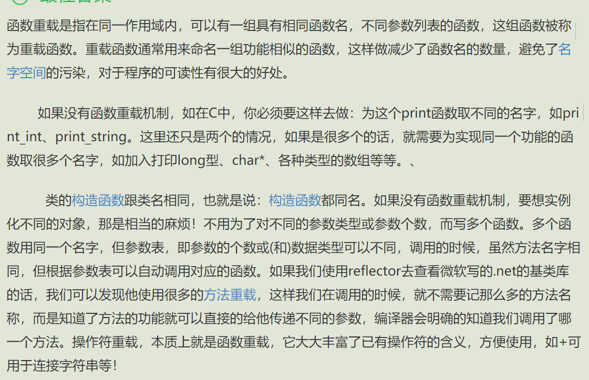
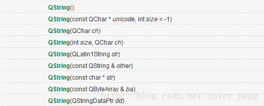
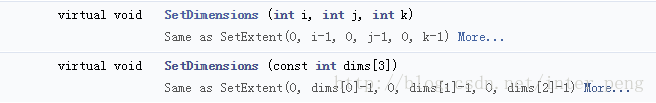
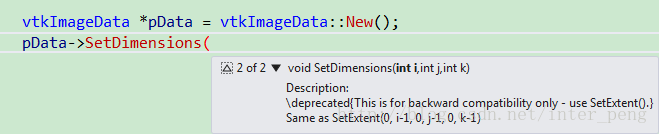

# 函数重载

## 1 函数重载概念

- 当函数具有相同的名称，但是参数列表不相同的情形（包括参数的个数不同或参数的类型不同），这样的同名而不同参数的函数之间，互相被称之为重载函数。

## 2 条件

- 函数名必须相同
- 函数参数必须不相同，可以是参数类型或者参数个数不同；
- 函数返回值可以相同，也可以不相同。（备注：但是如果函数的名称和参数完全相同，仅仅是返回值类型不同，是无法进行函数重载的。）

## 3 注意

- 只能通过不同的参数样式进行重载，例如：不同的参数类型，不同的参数个数，或者不同的参数顺序；
- 不能通过访问权限、返回类型、抛出的异常不同而进行重载；
- 重载的函数应该在相同的作用域下。

## 4 示例

以下的集中写法，分别表示了哪些是重载的，哪些不是重载的。
(1) void func1( int arg1);
(2) void func1( double arg1);
(3) void func1( int arg1, int arg2);
(4) bool func1(int arg1, double arg2)
(5) int func1(int arg1);

在上述的 5 个函数中，函数名称都是 func1，完全相同；但是：
(2)与(1)的参数个数相同，参数类型不同，构成重载；
(3)与(1)和(2)的参数个数不同，构成重载；
(4)与(1)和(2)的参数个数不同，与(3)的参数个数相同，但是第二个参数类型不同，构成重载；
(5)与(1)的参数个数和参数类型均相同，仅返回值的类型不相同，不构成重载；但是(5)与(2),(3)和(4)除返回值不同外，均有参数类型或参数个数不同的情况，因此构成重载关系。

## 5 应用

**读者可能会问，既然函数重载这个概念这么拗口，而且有时候又容易和函数重写概念弄混而导致出错，那么为什么在 C++里面要有这么一个概念出现呢?**
原因其实也很简单，就是因为在一个程序中，会出现很多很多，完成的函数功能完全相同，而仅仅是函数的参数略有不同的情形。这时如果没有函数重载这个概念，那么开发人员恐怕就要为如何为功能完全相同的函数起不同的名而头疼了。



**（1）类的构造函数**，通常就是函数重载的典型应用。因为一个类通常是可以有很多种构造方式的。
如 QT 里面的 QString 类的构造函数，提供了 9 种不同的构造函数，这 9 种构造函数的函数名完全相同，但是它们的参数类型或参数个数却不完全相同，因此是合法的。如图所示：



**（2）类的成员函数**，如赋值函数等。
如 VTK 的 vtkImageData 类的两个成员函数就是重载的。如：


这两个成员函数的函数名称都是 SetDimensions(),但是第一个函数的参数是 3 个 int 型的值；另一个函数的参数是一个 const int 型的数组，返回值都是 void。这样也是可以构成函数重载的。

在安装有编程助手的情况下编写代码时，如果遇到一个类的成员函数有重载时，助手通常会提示开发者，要选择哪一个重载函数。如下图所示。vtkImageData 的 SetDimensions()函数有两个重载形式，因此在编写代码时，助手会提示 2 of 2，表示这是 2 个重载函数中的第二个，点击可以切换到第一个重载函数。开发者需要根据上下文的要求，来选择相应的重载函数进行编写。


## JS 模拟函数重载

- js 的 arguments 对象可以接收函数调用时的实参，因此，实参多于形参，甚至没有形参时，程序都不会报错，反正你给多少实参我都收着，来者不拒，来一个在我这儿是 arguments[0]，来第二个是 arguments[1]，依次类推。arguments 对象的 length 属性，可以获取函数的实参个数。

```html
<!DOCTYPE html>
<html lang="en">
  <head>
    <meta charset="UTF-8" />
    <title>js模拟重载</title>
  </head>
  <body>
    <script type="text/javascript">
      //arguments对象可接收实参，arguments对象的length属性可获取实参个数。
      function add() {
        if (arguments.length == 0) {
          document.writeln("没有参数，你让我加什么？");
          document.write("<br>");
        } else if (arguments.length == 1) {
          document.writeln(arguments[0]);
          document.write("<br>");
        } else {
          var n = 0;
          len = arguments.length;
          for (var i = 0; i < len; i++) {
            n += arguments[i];
          }
          document.writeln(n);
          document.write("<br>");
        }
      }

      add();
      add(1);
      add(1, 2);
      add(1, 2, 3);
    </script>
  </body>
</html>
```
