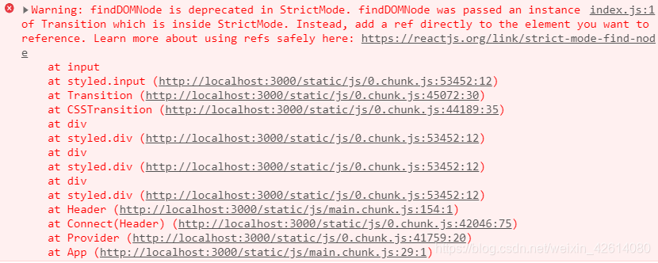
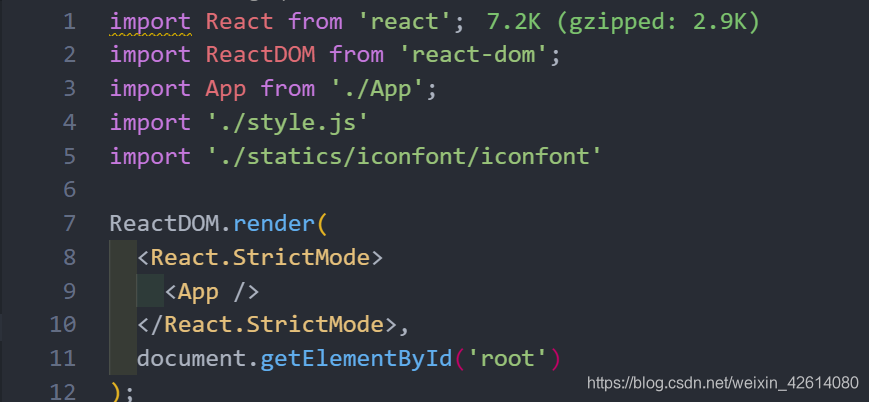
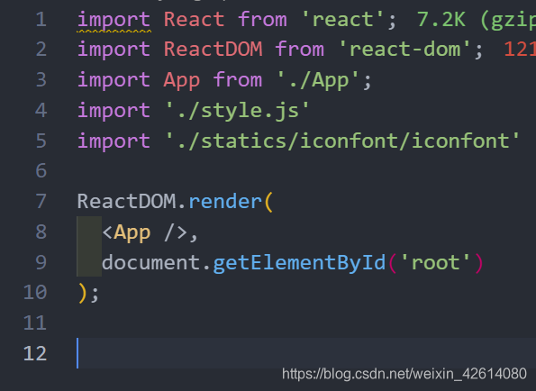

# React Tips

## 1.findDOMNode is deprecated in StrictMode. findDOMNode was passed an instance of Transition which 的解决

- 问题的分析：这个错误描述的是在 StrictMode 中不推荐使用 findDOMNode，findDOMNode 被传递到 StrictMode 内的转换实例。相反，直接向要引用的元素添加 ref。这个实际上就是开启了 react 的严格模式，使用了 <React.StrictMode> 标签。

- 问题的解决：关闭严格模式，在 index.js 文件中，删除 <React.StrictMode> 标签，警告就会消失了，如下所示

