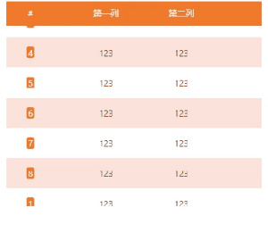

# vue2 自动滚动列表组件

- 1.循环滚动，滚完数据之后会继续从头开始滚动
- 2.实现鼠标移入，停止滚动；鼠标移出，继续滚动；
- 3.实现滚轮在指定区域内滚动，能够控制控制上下滚动

## 实现效果



## 代码实现

```vue
<template>
  <div class="scroll-list">
    <div
      class="scroll-list-head"
      :style="{ backgroundColor: defaultConfig.headerBGC }"
    >
      <span
        class="scroll-list-head-index"
        v-if="defaultConfig.index"
        :style="{
          width: defaultConfig.columnWidth[0] + 'px',
        }"
        >{{ defaultConfig.indexHeader }}</span
      >
      <span
        class="scroll-list-head-title"
        v-for="(item, index) in defaultConfig.header"
        :style="{
          width: defaultConfig.columnWidth[index + 1]
            ? defaultConfig.columnWidth[index + 1] + 'px'
            : '60px',
        }"
        :key="index"
        >{{ item }}</span
      >
    </div>
    <div
      ref="container"
      class="scroll-list-content"
      @mouseenter.prevent="stopScrolling"
      @mouseleave.prevent="startScrollingOnLeave"
      @wheel.prevent="handleScroll"
    >
      <ul>
        <li
          v-for="(item, index) in defaultConfig.data"
          ref="item"
          :key="index"
          class="scroll-list-li"
        >
          <div
            class="scroll-list-item"
            :style="{
              transform: `translateY(-${currentScrollTop}px)`,
              backgroundColor:
                item.id % 2 === 0
                  ? defaultConfig.oddRowBGC
                  : defaultConfig.evenRowBGC,
            }"
          >
            <div
              class="scroll-list-item-index"
              v-if="defaultConfig.index"
              :style="{
                width: defaultConfig.columnWidth[0] + 'px',
              }"
            >
              <span :style="{ backgroundColor: defaultConfig.headerBGC }">{{
                item.id
              }}</span>
            </div>
            <span
              class="scroll-list-item-content"
              :style="{
                width: defaultConfig.columnWidth[1]
                  ? defaultConfig.columnWidth[1] + 'px'
                  : '60px',
              }"
              >{{ item.name }}</span
            >
            <span
              class="scroll-list-item-content"
              :style="{
                width: defaultConfig.columnWidth[2]
                  ? defaultConfig.columnWidth[2] + 'px'
                  : '60px',
              }"
              >{{ item.value }}</span
            >
          </div>
        </li>
      </ul>
    </div>
  </div>
</template>

<script>
export default {
  props: {
    config: {
      type: Object,
      default: () => ({}),
    },
  },
  data() {
    return {
      /**
       * @param {Array} header - 表头数据
       * @param {Array} data - 数据
       * @param {String} headerBGC - 表头背景色
       * @param {String} oddRowBGC - 奇数行背景色
       * @param {String} evenRowBGC - 偶数行背景色
       * @param {Array} columnWidth - 列宽
       * @param {Boolean} index - 是否显示序号
       * @param {String} indexHeader - 序号列名
       */
      defaultConfig: {
        /**
         * @description Board header
         * @type {Array<String>}
         * @default header = []
         * @example header = ['column1', 'column2', 'column3']
         */
        header: [],
        /**
         * @description Board data
         * @type {Array<Array>}
         * @default data = []
         */
        data: [],
        /**
         * @description Header background color
         * @type {String}
         * @default headerBGC = '#00BAFF'
         */
        headerBGC: "#f1792b",
        /**
         * @description Odd row background color
         * @type {String}
         * @default oddRowBGC = '#003B51'
         */
        oddRowBGC: "#fde2db",
        /**
         * @description Even row background color
         * @type {String}
         * @default evenRowBGC = '#003B51'
         */
        evenRowBGC: "#ffffff",
        /**
         * @description Column width
         * @type {Array<Number>}
         * @default columnWidth = []
         */
        columnWidth: [60],
        /**
         * @description Show index
         * @type {Boolean}
         * @default index = false
         */
        index: true,
        /**
         * @description index Header
         * @type {String}
         * @default indexHeader = '#'
         */
        indexHeader: "#",
      },
      scrollSpeed: 80, // 滚动速度，单位为毫秒
      scrollInterval: null, // 滚动间隔的引用
      containerHeight: 0, // 容器高度
      dataListHeight: 0, // 单个字幕的高度
      currentScrollTop: 0, // 当前滚动的位置
      isHovering: false, // 标记鼠标是否悬停在容器上
    };
  },
  watch: {
    config(val) {
      this.defaultConfig = val;
      this.$nextTick(() => {
        clearInterval(this.scrollInterval);
        this.currentScrollTop = 0;
        this.dataListHeight =
          this.$refs.container.querySelector(".scroll-list-li").offsetHeight;
        this.startScrolling();
      });
    },
  },
  mounted() {
    this.containerHeight = this.$refs.container.offsetHeight;
  },
  methods: {
    startScrolling() {
      if (
        this.containerHeight >=
        this.defaultConfig.data.length * this.dataListHeight
      ) {
        return;
      }
      if (!this.isHovering) {
        this.scrollInterval = setInterval(() => {
          this.currentScrollTop += 1;
          if (this.currentScrollTop >= this.dataListHeight) {
            this.currentScrollTop = 0;
            this.defaultConfig.data.push(this.defaultConfig.data.shift());
          }
        }, this.scrollSpeed);
      }
    },
    stopScrolling() {
      clearInterval(this.scrollInterval);
      this.isHovering = true;
    },
    startScrollingOnLeave() {
      if (this.isHovering) {
        this.isHovering = false;
        this.startScrolling();
      }
    },
    handleScroll(event) {
      this.currentScrollTop += event.deltaY;
      if (this.currentScrollTop < 0) {
        this.currentScrollTop = 0;
      } else if (
        this.currentScrollTop >
        this.defaultConfig.data.length * this.dataListHeight -
          this.containerHeight
      ) {
        this.currentScrollTop =
          this.defaultConfig.data.length * this.dataListHeight -
          this.containerHeight;
      }
    },
  },
  beforeDestroy() {
    clearInterval(this.scrollInterval); // 在组件销毁前清除滚动间隔
  },
};
</script>

<style lang="less" scoped>
.scroll-list {
  text-align: center;
  overflow: hidden;
  width: 100%;
  .scroll-list-head {
    padding: 0;
    height: 40px;
    display: flex;
    align-items: center;
    color: #fff;
    z-index: 100;
    position: relative;
    .scroll-list-head-index {
      margin: 10px;
      box-sizing: border-box;
      text-overflow: ellipsis;
      white-space: nowrap;
      overflow: hidden;
    }
    .scroll-list-head-title {
      margin: 10px;
      box-sizing: border-box;
      text-overflow: ellipsis;
      white-space: nowrap;
      overflow: hidden;
    }
  }
  .scroll-list-content {
    height: 300px;
    z-index: 10;
    ul {
      padding: 0;
      margin: 0;
      list-style-type: none;
    }
    .scroll-list-li {
      line-height: 30px; /* 调整为适当的行高 */
      text-overflow: ellipsis;
      .scroll-list-item {
        display: flex;
        align-items: center;
        .scroll-list-item-index {
          font-size: 14px;
          text-align: center;
          color: #fff;
          margin: 10px;
          text-overflow: ellipsis;
          white-space: nowrap;
          overflow: hidden;
          box-sizing: border-box;
          span {
            border-radius: 3px;
            padding: 0 2px;
          }
        }
        .scroll-list-item-content {
          font-size: 14px;
          text-align: center;
          color: #333;
          margin: 10px;
          text-overflow: ellipsis;
          white-space: nowrap;
          overflow: hidden;
          box-sizing: border-box;
        }
      }
    }
  }
}
</style>
```
