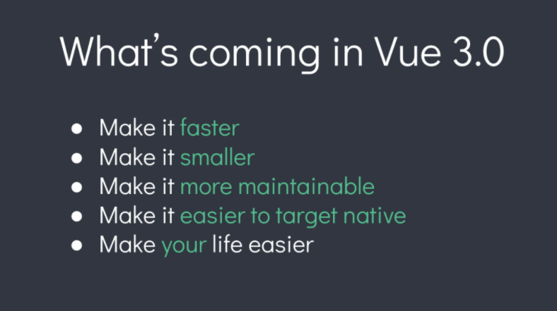
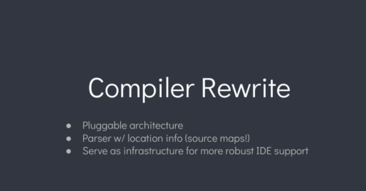
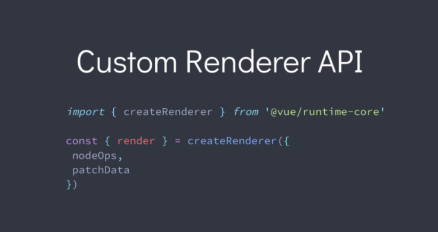
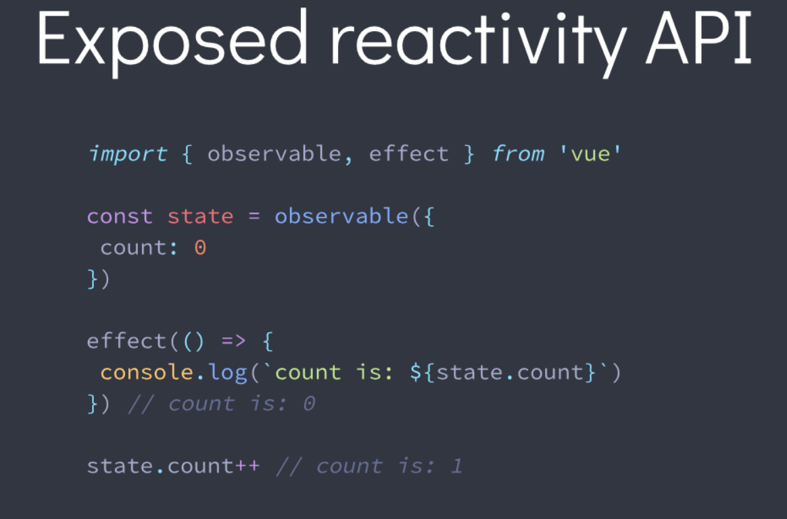
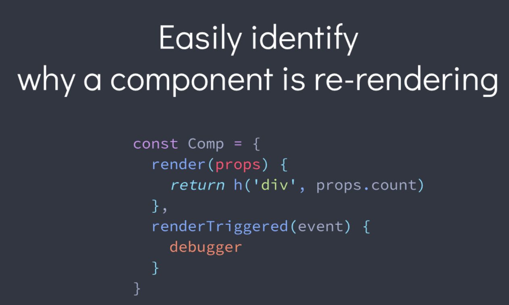
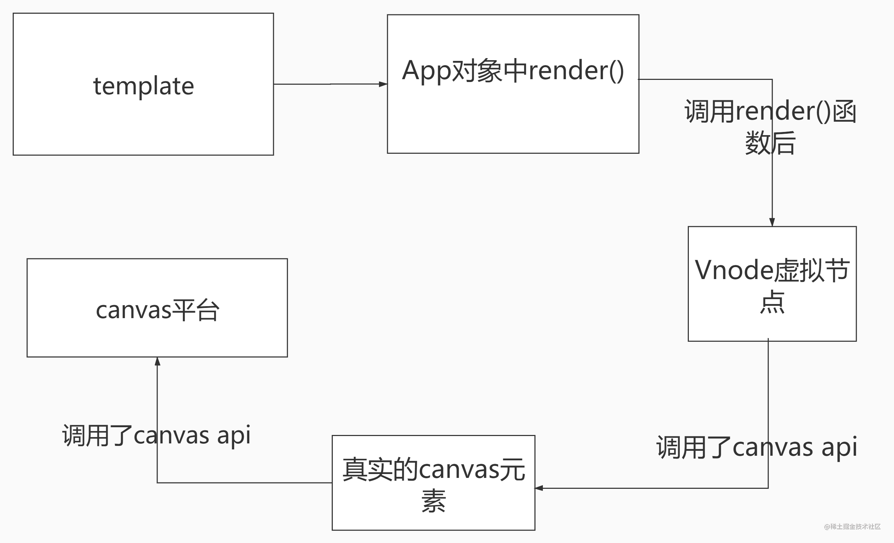

# Vue2 与 Vue3 的区别

## 一、Vue3 变化


`vue3`新增特性：

- 速度更快
- 体积更小
- 更易维护
- 更接近原生
- 更易使用

### 速度更快

`vue3`相比`vue2`

- 重写虚拟 dom
- 编译模板的优化
- 更高效的组件初始化
- `update`性能提高 1.3~2 倍
- `SSR`提高 2~3 倍

### 体积更小

通过`webpack`的`tree-shaking`功能，可以将无用的模块删除，减少打包体积。
`tree-shaking`两大好处：

- 开发人员来说，能对`vue`实现更多其他的功能，不必担薪体积过于庞大
- 使用者来说，打包出来的体积更小，加载速度更快

### 更易维护

**Composition Api**

- 可与现在 Option Api 混用
- 灵活的逻辑组合与复用
- Vue3 模块可以与其他框架搭配使用

### 更好的 TypeScript 支持

`vue3`基于`TypeScript`编写，可以享受自动的类型定义提示，并且提供了更好的类型支持。

### 编译器重写



### 更接近原生

可以自定义渲染 API


### 更易使用

响应式`Api`暴露出来



轻松识别组件重新渲染原因



## 二、Vue3 新增特性

Vue3 新功能：

- framents
- Teleport
- composition API
- createRenderer

### Fragments

`vue3`新增了`Fragments`，组件支持多个根节点，可以简化模板结构，减少`DOM`层级。

```html
<!-- Layout.vue -->
<template>
  <header>...</header>
  <main v-bind="$attrs">...</main>
  <footer>...</footer>
</template>
```

### Teleport

`vue3`新增了`Teleport`，将组件内容传送到指定位置,就是能够将模板移动到`DOM`中的`Vue app`之外的其他位置的技术，例如哆啦 A 梦的"任意门"。

`vue2`中，类似 modal、toast 这样的元素，如果嵌套在某个组件内，处理嵌套组件的定位，`z-index`和样式就会很困难。

通过`Teleport`，可以解决这个问题。

```vue
<button @click="showToast" class="btn">打开 toast</button>
<!-- to 属性就是目标位置 -->
<teleport to="#teleport-target">
    <div v-if="visible" class="toast-wrap">
        <div class="toast-msg">我是一个 Toast 文案</div>
    </div>
</teleport>
```

### composition API

composition Api，也就是组合式`api`，通过这种形式，我们能够更加容易维护我们的代码，将相同功能的变量进行一个集中式的管理


优势:
1. 逻辑复用
2. 更好的类型推导 Typescript支持
3. 更好的代码组织

### createRenderer

`vue3`新增了`createRenderer`，可以自定义渲染器,能够将`vue`的开发模型扩展到其他平台



```js
import { createRenderer } from "@vue/runtime-core";

const { render, createApp } = createRenderer({
  patchProp,
  insert,
  remove,
  createElement,
  // ...
});

export { render, createApp };

export * from "@vue/runtime-core";
```

## 三、非兼容变更

### Global API

- 全局`Vue API`已更改为使用应用程序实例
- 全局和内部`API`已经被重构为可`tree-shakable`

### 模版指令

- 在组件上`v-model`用法更改

  - 非兼容：

    - prop：`value` -> `modelValue`
    - event：`input` -> `update:modelValue`
    - `v-bind` 的 `.sync` 修饰符和组件的 model 选项已移除，可用 `v-model` 作为代替

    ```js
    // ChildComponent.vue
    export default {
      props: {
        modelValue: String, // 以前是`value：String`
      },
      emits: ["update:modelValue"],
      methods: {
        changePageTitle(title) {
          // 以前是 `this.$emit('input', title)`
          this.$emit("update:modelValue", title);
        },
      },
    };
    ```

  - 新增：

    - 现在可以在同一个组件上使用多个 v-model 进行双向绑定

    ```vue
    <ChildComponent v-model:title="pageTitle" v-model:content="pageContent" />

    <!-- 是以下的简写： -->

    <ChildComponent
      :title="pageTitle"
      @update:title="pageTitle = $event"
      :content="pageContent"
      @update:content="pageContent = $event"
    />
    ```

    - 现在可以自定义 `v-model` 修饰符

    ```vue
    <div id="app">
    <my-component v-model.capitalize="myText"></my-component>
    {{ myText }}
    </div>
    ```

    ```
    app.component('my-component', {
        props: {
        modelValue: String,
        modelModifiers: {
        default: () => ({})
        }
    },
    emits: ['update:modelValue'],
    template: `
        <input type="text"
        :value="modelValue"
        @input="$emit('update:modelValue', $event.target.value)">
    `,
    created() {
        console.log(this.modelModifiers) // { capitalize: true }
    }
    })
    ```

- `<template v-for>`和非`v-for`节点上`key`用法已更改

  ```vue
  <!-- 旧的用法（Vue 2）-->
  <template v-for="item in items" :key="item.id">
    <div>{{ item.text }}</div>
  </template>
  <!-- 新的用法（Vue 3）-->
  <div v-for="item in items" :key="item.id">
  {{ item.text }}
  </div>
  ```

- 在同一元素上使用的`v-if`和`v-for`优先级已更改

  [v-if 与 v-for 的区别](./vIf-vFor.md)

- `v-bind="object"`现在排序敏感
  - `Vue 2.x` 如果一个元素同时定义了 `v-bind="object"` 和一个相同的单独的 `property`，那么这个单独的 `property` 总是会覆盖 `object` 中的绑定。
  - `Vue 3.x` 声明绑定的顺序决定了它们如何合并。
  ```vue
  // 2.x中 id最终为red 3.x中 id为blue
  <div id="red" v-bind="{ id: 'blue' }"></div>
  ```
- `v-for`中的`ref`不再注册`ref`数组

  - `Vue 2`中，在`v-for`里使用`ref`属性时，从`$refs`中获取的相应属性会是一个`ref`数组。
  - `Vue 3`中则将`ref`绑定到一个更灵活的函数上(ele) => { …//保存 ele 的操作 }：

  ```vue
  <template>
    <div v-for="item in list" :ref="setItemRef"></div>
  </template>
  <script>
  import { ref, onBeforeUpdate, onUpdated } from "vue";
  export default {
    setup() {
      let itemRefs = [];
      const setItemRef = (el) => {
        itemRefs.push(el);
      };
      onBeforeUpdate(() => {
        itemRefs = [];
      });
      onUpdated(() => {
        console.log(itemRefs);
      });
      return {
        itemRefs,
        setItemRef,
      };
    },
  };
  </script>
  ```

### 组件

- 只能使用普通函数创建功能组件

> 在 3.x 中，2.x 带来的函数式组件的性能提升可以忽略不计，因此我们建议只使用有状态的组件函数式组件只能由接收 props 和 context (即：slots、attrs、emit) 的普通函数创建。  
> 非兼容：functional attribute 已从单文件组件 (SFC) 的 中移除。  
> 非兼容：{ functional: true } 选项已从通过函数创建的组件中移除。

```js
// Vue 2 函数式组件示例
export default {
  functional: true,
  props: ["level"],
  render(h, { props, data, children }) {
    return h(`h${props.level}`, data, children);
  },
};
```

> 现在，在 Vue 3 中，所有的函数式组件都是用普通函数创建的。换句话说，不需要定义 { functional: true } 组件选项。
> 它们将接收两个参数：props 和 context。context 参数是一个对象，包含组件的 attrs、slots 和 emit property。  
> 此外，h 现在是全局导入的，而不是在 render 函数中隐式提供。

```js
import { h } from "vue";
const DynamicHeading = (props, context) => {
  return h(`h${props.level}`, context.attrs, context.slots);
};
DynamicHeading.props = ["level"];
export default DynamicHeading;
```

- 异步组件现在需要 `defineAsyncComponent` 方法来创建

  > 新的 defineAsyncComponent 助手方法，用于显式地定义异步组件  
  > component 选项被重命名为 loader  
  > Loader 函数本身不再接收 resolve 和 reject 参数，且必须返回一个 Promise

  **2.x**

  ```js
  const asyncModal = () => import("./Modal.vue");
  //或者带有选项
  const asyncModal = {
    component: () => import("./Modal.vue"),
    delay: 200,
    timeout: 3000,
    error: ErrorComponent,
    loading: LoadingComponent,
  };
  ```

  **3.x**

  ```js
  import { defineAsyncComponent } from "vue";
  import ErrorComponent from "./components/ErrorComponent.vue";
  import LoadingComponent from "./components/LoadingComponent.vue";
  // 不带选项的异步组件
  const asyncModal = defineAsyncComponent(() => import("./Modal.vue"));
  // 带选项的异步组件
  const asyncModalWithOptions = defineAsyncComponent({
    loader: () => import("./Modal.vue"),
    delay: 200,
    timeout: 3000,
    errorComponent: ErrorComponent,
    loadingComponent: LoadingComponent,
  });
  // () =>
  // new Promise((resolve, reject) => {
  // })
  ```

### 渲染函数

- 渲染函数 API 改变

  - 渲染函数参数

  ```js
    // 在 2.x 中，render 函数会自动接收 h 函数 (它是 createElement 的惯用别名) 作为参数：
    export default {
        render(h) {
            return h('div')
        }
    }
    // 在 3.x 中，h 函数现在是全局导入的，而不是作为参数自动传递。
    import { h } from 'vue'
    export default {
        render() {
            return h('div')
        }
    }
  ```

  - 渲染函数签名更改

  ```js
  // 在 2.x 中，render 函数自动接收参数，如 h 函数。
    export default {
        render(h) {
            return h('div')
        }
    }
    // 在 3.x 中，由于 render 函数不再接收任何参数，它将主要在 setup() 函数内部使用。
    // 这还有一个好处：可以访问在作用域中声明的响应式状态和函数，以及传递给 setup() 的参数。
    import { h, reactive } from 'vue'
    export default {
        setup(props, { slots, attrs, emit }) {
            const state = reactive({
                count: 0
            })
            function increment() {
                state.count++
            }
        // 返回渲染函数
        return () =>
        h(
            'div',
        {
            onClick: increment
        },
        state.count
        )
    }
  }
  ```

- $scopedSlots property 已删除，所有插槽都通过 $slots 作为函数暴露
  - 作用域插槽
  ```js
  //2.x
  this.$scopedSlots.default(this.data);
  //3.x
  this.$slots.default ? this.$slots.default(this.data) : undefined;
  ```
  - 非作用域插槽
  ```js
  //2.x
  this.$scopedSlots.default;
  //3.x
  this.$slots.default;
  ```
- 自定义指令 API 已更改为与组件生命周期一致
  - 在 Vue 2 中，自定义指令通过使用下列钩子来创建，以对齐元素的生命周期，它们都是可选的：
    - `bind` → 指令绑定到元素后调用。只调用一次。
    - `inserted` → 元素插入父 DOM 后调用。
    - `update` → 当元素更新，但子元素尚未更新时，将调用此钩子。
    - `componentUpdated` → 一旦组件和子级被更新，就会调用这个钩子。
    - `unbind` → 一旦指令被移除，就会调用这个钩子。也只调用一次。
  - 在 Vue 3 中，我们为自定义指令创建了一个更具凝聚力的 API。相较于 Vue2，自定义指令 API 与组件生命周期一致，便于记忆。且新增两个钩子，功能更加强大。
    - `created` → 新增！在元素的 `attribute` 或事件监听器被应用之前调用。
    - `bind` → `beforeMount`
    - `inserted` → `mounted`
    - `beforeUpdate`：新增！在元素本身被更新之前调用，与组件的生命周期钩子十分相似。
    - `componentUpdated` → updated
    - `beforeUnmount`：新增！与组件的生命周期钩子类似，它将在元素被卸载之前调用。
    - `unbind` -> `unmounted`
- 一些转换 class 被重命名了：
  - v-enter -> v-enter-from
  - v-leave -> v-leave-from
- 组件 watch 选项和实例方法 $watch 不再支持点分隔字符串路径，请改用计算函数作为参数
- 在 Vue 2.x 中，应用根容器的 outerHTML 将替换为根组件模板 (如果根组件没有模板/渲染选项，则最终编译为模板)。VUE3.x 现在使用应用程序容器的 innerHTML。

### 其他小改变

- `destroyed` 生命周期选项被重命名为 `unmounted`
- `beforeDestroy` 生命周期选项被重命名为 `beforeUnmount`
- `prop default` 工厂函数不再有权访问 `this` 是上下文
- 自定义指令 API 已更改为与组件生命周期一致
- `data` 应始终声明为函数
- 来自 `mixin` 的 `data` 选项现在可简单地合并
- `attribute` 强制策略已更改
- 一些过渡 class 被重命名
- 组建 `watch` 选项和实例方法 `$watch` 不再支持以点分隔的字符串路径。请改用计算属性函数作为参数。
- `<template>` 没有特殊指令的标记 (`v-if/else-if/else`、`v-for` 或 `v-slot`) 现在被视为普通元素，并将生成原生的 `<template>` 元素，而不是渲染其内部内容。
- 在 `Vue 2.x` 中，应用根容器的 `outerHTML` 将替换为根组件模板 (如果根组件没有模板/渲染选项，则最终编译为模板)。`Vue 3.x` 现在使用应用容器的 `innerHTML`，这意味着容器本身不再被视为模板的一部分。

### 移除 API

- `keyCode` 支持作为 `v-on` 的修饰符
- `$on`，`$off`和`$once` 实例方法
- 过滤`filter`
- 内联模板 `attribute`
- `$destroy` 实例方法。用户不应再手动管理单个`Vue`组件的生命周期。
