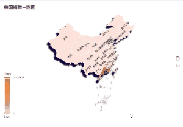

# Echarts Map 地图
* 1.可点击地图下钻下一级地图、右键返回上一级地图
* 2.地图视觉立体感、
* 3.地图图例配置，根据数据大小显示不同颜色

**实现效果**


```vue
<!-- 数据大屏 -->
<template>
  <CardBox class="map-card">
    <div ref="geoEcharts" class="map"></div>
  </CardBox>
</template>

<script>
import * as echarts from 'echarts'
import { regions } from '../mapCode/chinaRegions'
export default {
  props: {
    seriesData: {
      type: Array,
      default: () => []
    },
    seriesName: {
      type: String,
      default: 'number'
    }
  },
  data() {
    return {
      ROOT_PATH: process.env.VUE_APP_COS_BASE_URL,
      // 地图实例
      map: null,
      // 地图配置
      option: {
        title: {
          text: '',
          left: 'left'
          // textStyle: {
          //   color: '#fff'
          // }
        },
        // 悬浮窗
        tooltip: {
          trigger: 'item',
          formatter: function(params) {
            return `${params.name}  :${params.value || 0}`
          }
        },
        toolbox: {
          show: true,
          orient: 'vertical',
          left: 'right',
          top: 'center',
          feature: {
            dataView: { readOnly: true },
            saveAsImage: {}
          }
        },
        visualMap: {
          min: 0,
          // max: 200003,
          text: ['High', 'Low'],
          realtime: false,
          calculable: true,
          inRange: {
            color: ['#f9c9aa', '#f8bc95', '#f7af80', '#f5a16b', '#f49455', '#f28640', '#f1792b', '#d96d27', '#c16122']
          }
        },
        // 第一层
        geo: {
          map: '',
          zoom: 1,
          z: 1,
          // roam: true,
          // top: '10%',
          layoutSize: '100%', //保持地图宽高比
          // 缩放大小限制
          scaleLimit: {
            min: 0.5,
            max: 12
          },
          regions: [
            {
              // 隐藏南海诸岛,因为顶层已经添加过了
              name: '南海诸岛',
              itemStyle: {
                borderWidth: 0.5,
                shadowBlur: 0,
                borderColor: '#61aacb',
                areaColor: '#fde2db'
              }
            }
          ],
          itemStyle: {
            borderColor: '#ffffff',
            borderWidth: 1,
            shadowBlur: 3,
            shadowOffsetX: -8,
            shadowOffsetY: 10,
            shadowColor: '#090438'
            // areaColor: '#0862db'
          }
        },
        series: {
          type: 'map',
          map: '',
          zoom: 1,
          // roam: true,
          // 缩放大小限制
          scaleLimit: {
            min: 0.5,
            max: 12
          },
          z: 10,
          // aspectScale: 0.75,
          itemStyle: {
            borderColor: '#ffffff',
            borderWidth: 0.5,
            // shadowBlur: 3,
            shadowColor: '#66edff',
            areaColor: '#fde2db'
          },
          label: {
            show: true,
            color: 'black',
            position: 'inside',
            distance: 0,
            fontSize: 10,
            rotate: 45
          },
          nameMap: {
            新疆维吾尔自治区: '新疆',
            西藏自治区: '西藏',
            甘肃省: '甘肃',
            宁夏回族自治区: '宁夏',
            广西壮族自治区: '广西',
            内蒙古自治区: '内蒙古',
            香港特别行政区: '香港',
            澳门特别行政区: '澳门'
          },
          regions: [
            {
              // 隐藏南海诸岛,因为顶层已经添加过了
              name: '南海诸岛',
              itemStyle: {
                borderWidth: 0.5,
                shadowBlur: 0,
                borderColor: '#61aacb',
                areaColor: '#104584'
              }
            }
          ],
          emphasis: {
            itemStyle: {
              shadowBlur: 10,
              borderWidth: 1,
              areaColor: '#ad7c5a'
            },
            label: {
              show: true,
              color: '#ffffff'
            }
          },
          data: []
        }
      },
      // 上一级地图
      prevMap: [],
      // 当前地图
      curMap: '中国',
      curLevel: 0,
      // 重绘地图定时器
      resizeTimer: null
    }
  },
  watch: {
    seriesData(val) {
      this.option.tooltip.formatter = params => {
        if (this.seriesName === 'number') {
          return `${params.name}  :${params.value || 0}`
        } else {
          return `${params.name}  :￥${params.value || 0}`
        }
      }
      this.option.series.data = val
      const valueList = val.map(item => item.value)
      this.option.visualMap.max = Math.max(...valueList)
      this.changeMap(this.curMap)
    }
  },
  mounted() {
    this.initMap('中国')
    this.map.on('click', params => {
      this.map.showLoading()
      // 记录上一级地图
      if (this.prevMap.length < 3) {
        this.prevMap.push(this.curMap)
        this.curLevel++
        this.curMap = params.name
      }
      this.$emit('clickMap', params.name, this.curLevel)
    })
    let mapRight = this.$refs['geoEcharts']
    mapRight.oncontextmenu = () => {
      return false
    }
    // 绑定右键事件，返回全国地图
    this.map.on('contextmenu', params => {
      this.map.showLoading()
      //当双击事件发生时，清除单击事件，仅响应双击事件
      //返回上一级地图
      this.curMap = this.prevMap[this.curLevel - 1]
      this.prevMap.pop()
      this.curLevel--
      this.$emit('clickMap', this.curMap, this.curLevel)
    })
    this.$nextTick(() => {
      window.addEventListener('resize', () => {
        if (this.resizeTimer) clearTimeout(this.resizeTimer)
        this.resizeTimer = setTimeout(() => {
          this.map.resize()
        }, 100)
      })
    })
  },

  methods: {
    // 初始化地图
    initMap(name) {
      this.map = echarts.init(this.$refs['geoEcharts'], null, { renderer: 'svg' })
      this.changeMap(name)
    },
    changeMap(name) {
      const region = regions.find(region => region.name === name) //地区的json数据
      this.map.hideLoading()
      if (!region) {
        alert('无此区域地图显示')
        return
      } else {
        const mapCode = require(`../map/${region.code}.json`) //地区的地图编码
        echarts.registerMap(name, mapCode)
        this.option.geo.map = name
        this.option.series.map = name
        this.option.title.text = `${name}${this.seriesName === 'number' ? '销量' : '销售额'}--地图`
        this.map.setOption(this.option, true)
      }
    }
  }
}
</script>
<style lang="less" scoped>
.map-card {
  width: 100%;
  height: 500px;
  padding: 10px;
  .map {
    width: 100%;
    height: 460px;
  }
}
</style>

```